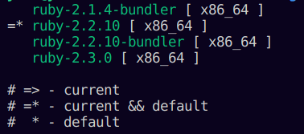

# Simple way to setup ruby on linux
12 Jun 2023


***What's the problems though ?***
--


* So recently I had to utilize a way to setup ruby, required by a jekyll template of Hugo. 

* It was 3 year old setup.

* Installed with package manager snap and apt.

Though packages were installed there were env related issues  <- **This is the main messup right here.**

---
## ***dependencies and env issues with ruby take much time to resolve.***
---


***What helped ?***
---

**RVM**

RVM is the keeper though <3 

It is called **Ruby Version Manager**, seems straightforward.

**Steps to setup RVM:-**

1. Execute the following shell commands

    ```shell
    sudo apt-get install software-properties-common -y
    sudo apt-add-repository -y ppa:rael-gc/rvm
    sudo apt-get update
    sudo apt-get install rvm -y
    sudo usermod -a -G rvm $USER
    echo 'source "/etc/profile.d/rvm.sh"' >> ~/.bashrc
    ```

2. Restart the shell that you are currently using (as we have added rvm.sh in it's bashrc)

3. Use the ```rvm``` command to set things up. (If you followed the above steps the binary ```rvm``` should be in the right path)


***How do you set things up using RVM ?***
---

Install the specific version as follows:-

```bash
rvm install ruby-2.2.10
```

One beautiful thing about this is that you can install multiple versions of the ruby on the same vm.

On executing ```rvm --list``` we can see all the versions setup as follows:-





reference: https://github.com/rvm/ubuntu_rvm


