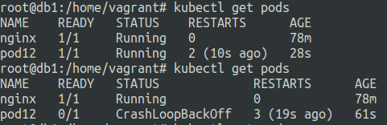
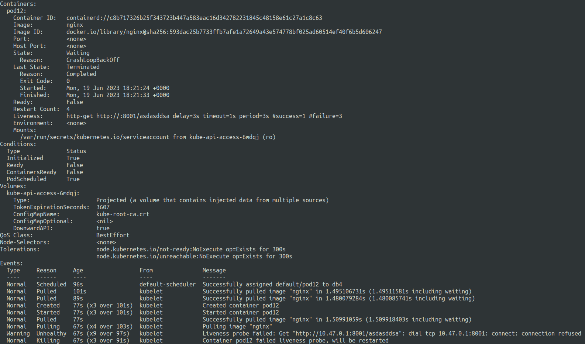
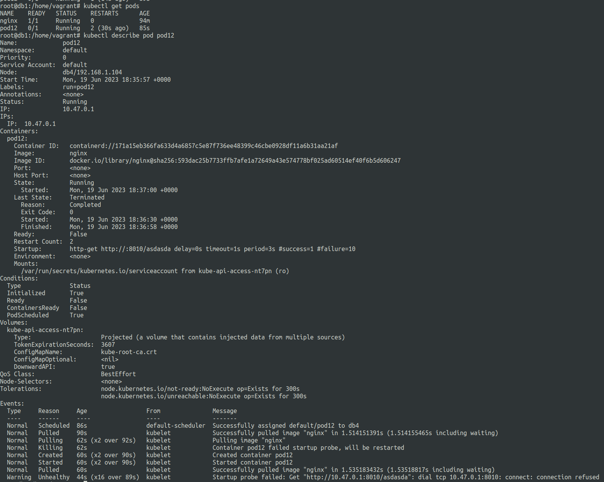

# Health monitoring in kubernetes
19 June 2023

## **Container health**

There are three main ways to manage container health:

**Liveness probe**
---

Automatically detect if a container is in healthy state or not.

Checks the container process at regular interval and if it is stopped the probe will set the container liveliness to be unhealthy.

We can modify this default mechanism as well.


**search_query**: ```liveliness probe```

**url**: https://kubernetes.io/docs/tasks/configure-pod-container/configure-liveness-readiness-startup-probes/

**nginx.yaml** (liveness probe using bash commands)

```
apiVersion: v1
kind: Pod
metadata:
  creationTimestamp: null
  labels:
    run: pod12
  name: pod12
spec:
  containers:
  - image: nginx
    name: pod12
    resources: {}
    livenessProbe:
      exec:
        command:
        - echo
        - Hello
      initialDelaySeconds: 5
      periodSeconds: 5
  dnsPolicy: ClusterFirst
  restartPolicy: Always
status: {}
```


**liveness-http-working.yaml** (liveness probe using http request)

```
apiVersion: v1
kind: Pod
metadata:
  creationTimestamp: null
  labels:
    run: pod12
  name: pod12
spec:
  containers:
  - image: nginx
    name: pod12
    resources: {}
    livenessProbe:
      httpGet:
        path: /
        port: 80
      initialDelaySeconds: 3
      periodSeconds: 3
  dnsPolicy: ClusterFirst
  restartPolicy: Always
status: {}
```

Now let us see what happens when the liveness fails.

**liveness-failed-http.yaml**

```
apiVersion: v1
kind: Pod
metadata:
  creationTimestamp: null
  labels:
    run: pod12
  name: pod12
spec:
  containers:
  - image: nginx
    name: pod12
    resources: {}
    livenessProbe:
      httpGet:
        path: /asdasddsa
        port: 8001
      initialDelaySeconds: 3
      periodSeconds: 3
  dnsPolicy: ClusterFirst
  restartPolicy: Always
status: {}
```





**Startup probe**
---

Similar to liveness probes but these probes run just once, during initial startup of the container.

Useful for legacy applications that require large wait before startup.

**search_query**: ```startup probe```

**url**: https://kubernetes.io/docs/tasks/configure-pod-container/configure-liveness-readiness-startup-probes/


Here ```failureThreshold x periodSeconds``` is the total wait time before the service should be up, else the container is killed and restartpolicy is applied.

**startup-probe-working.yaml**

```
apiVersion: v1
kind: Pod
metadata:
  creationTimestamp: null
  labels:
    run: pod12
  name: pod12
spec:
  containers:
  - image: nginx
    name: pod12
    resources: {}
    startupProbe:
      httpGet:
        path: /
        port: 80
      failureThreshold: 10
      periodSeconds: 3
  dnsPolicy: ClusterFirst
  restartPolicy: Always
status: {}
```

Let us see what happens when we let it fail.

**startup-probe-not-working.yaml**

```
apiVersion: v1
kind: Pod
metadata:
  creationTimestamp: null
  labels:
    run: pod12
  name: pod12
spec:
  containers:
  - image: nginx
    name: pod12
    resources: {}
    startupProbe:
      httpGet:
        path: /asdasda
        port: 8010
      failureThreshold: 10
      periodSeconds: 3
  dnsPolicy: ClusterFirst
  restartPolicy: Always
status: {}
```



**Readiness probe**
---

Tells when the container is ready to receive requests.

Marks the pod as ready.

No traffic will be sent to a container that is not in ready state. (To ensure proper functionality of the application in HA)

**search_query**: ```readiness probe```

**url**: https://kubernetes.io/docs/tasks/configure-pod-container/configure-liveness-readiness-startup-probes/


```
    readinessProbe:
      tcpSocket:
        port: 8080
      initialDelaySeconds: 5
      periodSeconds: 10
```

The above example sets the pod status to ready if within 5 seconds of the pod startup the request on port 8080 is successful, If it fails then the checks will run every 10 seconds to again detect. 

Once the request is succesful it will set the pod status to ready.
else it will stay unhealthy


All of these probes can have either cmd or http request.
