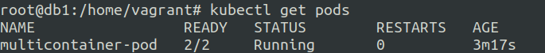
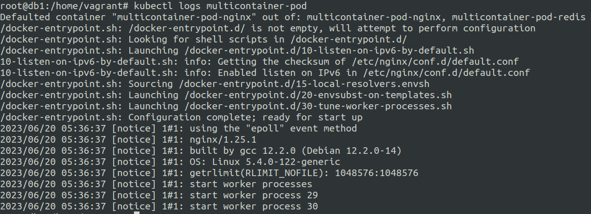

# Multicontainer Pods in Kubernetes
20 June 2023

Multiple containers inside a single kubernetes pod.

**What is the use case of multi containers in a single pod ?**

Well for tightly coupled applications and sidecar setup this is an efficient setup.

Sometimes you might need another container to process things from the main container kind of like a helper container.

mounted volumes to the pod can be used by all the containers in the pod.

network and storage are essentially shared among containers.

containers within the pod can communicate with each other without explicit port exposure.


let us create a simple template first using following command:

```kubectl run multicontainer-pod --image=nginx --dry-run=client -o yaml > multicontianerpod.yaml``` 


modify the **multicontainerpod.yaml** file as follows:-

```
apiVersion: v1
kind: Pod
metadata:
  creationTimestamp: null
  labels:
    run: multicontainer-pod
  name: multicontainer-pod
spec:
  containers:
  - image: nginx
    name: multicontainer-pod-nginx
    resources: {}
  - image: redis
    name: multicontainer-pod-redis
    resources: {}
  dnsPolicy: ClusterFirst
  restartPolicy: Always
status: {}
```






---

**Example**: where one pod prints something to a file another reads it.

**multi.yaml**
```
apiVersion: v1
kind: Pod
metadata:
  creationTimestamp: null
  labels:
    run: multi
  name: multi
spec:
  containers:
  - image: busybox
    name: bb1
    command: ['sh','-c','while true; do echo hello > /mountpath/Hello; sleep 5; done']
    volumeMounts:
    - name: myvolume
      mountPath: /mountpath
  - image: busybox
    name: bb2
    command: ['sh','-c','tail -f /mountpath/Hello;']
    volumeMounts:
    - name: myvolume
      mountPath: /mountpath
  volumes:
  - name: myvolume
  dnsPolicy: ClusterFirst
  restartPolicy: Always
status: {}
```

**output**:


