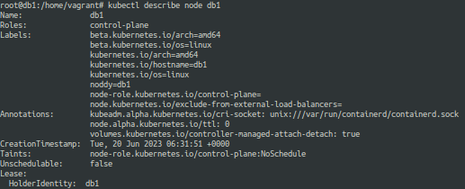
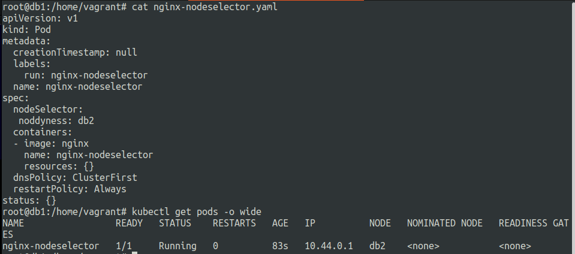

# Scheduling pods in kubernetes
20 June 2023


**Scheduling**: assigning pods to the nodes. scheduler manages the pods scheduling.

Primarily resource requests and node resource availability is checked by the kubernetes scheduler before scheduling the pod.


**nodeSelector**
---

limit which node pods can be scheduled. 

***uses node lables.***

example of node label :-

```kubectl label nodes NODE_NAME LABEL_KEY=LABEL_KEY_VALUE```


```kubectl label node db1 noddy=db1```

output of the label being assigned.


Now we have to create another label this time on node db2 because db1 node is control node and pods dont get assigned to it by default.

```kubectl label node db2 noddyness=db2```





**nginx-nodeselector.yaml**

```
apiVersion: v1
kind: Pod
metadata:
  creationTimestamp: null
  labels:
    run: nginx-nodeselector
  name: nginx-nodeselector
spec:
  nodeSelector:
   noddyness: db2
  containers:
  - image: nginx
    name: nginx-nodeselector
    resources: {}
  dnsPolicy: ClusterFirst
  restartPolicy: Always
status: {}
```




**nodeName**
---

bypass scheduling and direct association of pods to a particular node.

**nginx-nodename.yaml**

```
apiVersion: v1
kind: Pod
metadata:
  creationTimestamp: null
  labels:
    run: nginx-nodeselector
  name: nginx-nodeselector
spec:
  nodeName: db3
  containers:
  - image: nginx
    name: nginx-nodeselector
    resources: {}
  dnsPolicy: ClusterFirst
  restartPolicy: Always
status: {}
```


Need to be familiar with the ```nodeSelector``` and ```nodeName``` blocks.

They are defined under the Pod spec


