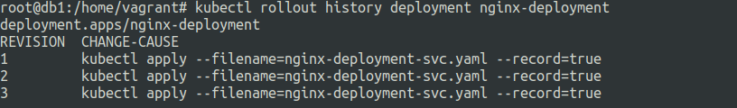
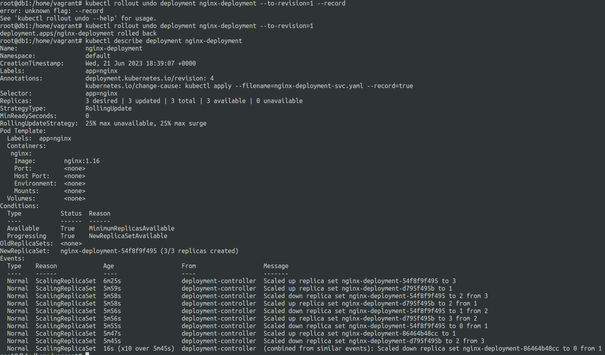

# Rolling updates in kubernetes
21 June 2023

Managed using deployments.


**Rolling update**: allows deployment to use new updates without downtime via gradual replacement of old pods with new updated ones.

Change can be anything in the pod template that is part of the deployment manifest.


**Rollback**: If there is a problem in the rolling update, we can go back to previous deployment revision.


**Example** :

nginx-deployment.yaml
```
apiVersion: apps/v1
kind: Deployment
metadata:
  name: nginx-deployment
  labels:
    app: nginx
spec:
  replicas: 3
  selector:
    matchLabels:
      app: nginx
  template:
    metadata:
      labels:
        app: nginx
    spec:
      containers:
      - name: nginx
        image: nginx:1.14.2
        ports:
        - containerPort: 80

```


rollouts can be done via ```kubectl edit deployment DEPLOYMENT_NAME```

or using ```kubectl apply -f DEPLOYMENT_MANIFEST.yaml``` after edits.

you can check the status of the deployment rollout using 

```kubectl rollout status deployment.v1.apps/DEPLOYMENT_NAME```

before applying things we need to make sure that we use ```--record``` flag for keeping track of the change cause. 

Example for **nginx-deployment.yaml** and **nginx-deployment** :

```kubectl apply --filename=nginx-deployment.yaml --record=true```

```kubectl edit deployment nginx-deployment --record=true```

Check the rollout status using:
```kubectl rollout history deployment.v1.apps/nginx-deployment``` or 
```kubectl rollout history deployment nginx-deployment``` 


--- 

**Example of rollout and rollback**

```
apiVersion: apps/v1
kind: Deployment
metadata:
  name: nginx-deployment
  labels:
    app: nginx
spec:
  replicas: 3
  selector:
    matchLabels:
      app: nginx
  template:
    metadata:
      labels:
        app: nginx
    spec:
      containers:
      - name: nginx
        image: nginx:1.16
---
apiVersion: v1
kind: Service
metadata:
  name: nginx-service
spec:
  clusterIP: 10.96.0.239
  selector:
    app: nginx
  ports:
  - name: name-of-service-port
    protocol: TCP
    port: 80
    targetPort: 80
```

so we will do 3 rollouts in order from nginx:1.16 to nginx:1.17 to nginx:1.18


**rollback deployment**
---

Deployment can be rolled back using ```kubectl rollout undo``` to a specific revision or to the previous revision.

```kubectl rollout undo deployment nginx-deployment --to-revision=1```




