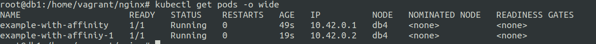
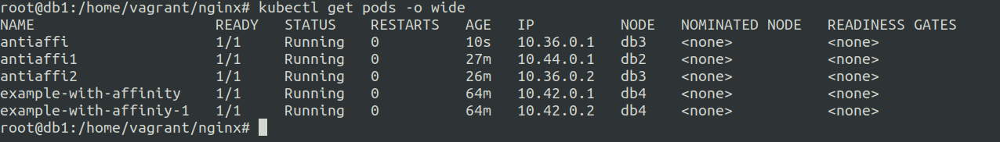

# Affinity and Antiaffinity in Kubernetes
30 June 2023

**Affinity**

Node affinity is somewhat like an attachment based on the labels that a node has, 

Let us say we need to schedule pods on nodes that have certain labels, we use node affinity to tell pods to schedule itself to the nodes with specified labels.


**Similar to nodeselector ?**

Nodeselector mentions nodes with relevant labels where pods should be scheduled on. 
Now using node selector does not give you much control over the scheduling and deployment. It is kind of fixed setup.


Node affinity provides more control over the pod placement apart from node labels it is also possible to set placement based on other pods position.


***So in short Affinity has more scope compared to nodeselector due to variety of options.***


For using affinity Node lables are required.


***Example of Affinity***
---

**affinity.yaml**
```
apiVersion: v1
kind: Pod
metadata:
  name: example-with-affinity
spec:
  affinity:
    nodeAffinity:
      requiredDuringSchedulingIgnoredDuringExecution:
        nodeSelectorTerms:
        - matchExpressions:
          - key: zone
            operator: In
            values:
            - main
  containers:
  - name: with-node-affinity
    image: registry.k8s.io/pause:2.0
```

Make sure to remove all the unwanted taints




---


**Inter-pod affinity and anti-affinity**
---

As affinity makes a pod attach to the nodes with relevant labels, antiaffinity is something that can help us in separating some pods from other pods based on their affinity.


So what anti affinity does is that it matches the labels of the pods that are already scheduled and running one few nodes. Anti affinity avoids scheduling of the pods to the nodes with the matched labels.


**antiaffinity.yaml**
```
apiVersion: v1
kind: Pod
metadata:
  name: antiaffi
spec:
  affinity:
    podAntiAffinity:
      requiredDuringSchedulingIgnoredDuringExecution:
        - labelSelector:
            matchExpressions:
            - key: name 
              operator: In
              values:
              - example-with-affinity
          topologyKey: "kubernetes.io/hostname"
  containers:
  - name: with-node-affinity
    image: registry.k8s.io/pause:2.0

```



Here pods antiaffi, antiaffi1 and antiaffi2 will never be scheduled on the node db4 as the db4 has the pods example-with-affinity and example-with-affinity-1 with the matched expressions of ```name: example-with-affinity```


search: affinity

ref: https://kubernetes.io/docs/concepts/scheduling-eviction/assign-pod-node/#:~:text=nodeSelector%20only%20selects%20nodes%20with,t%20find%20a%20matching%20node.

ref: https://kubernetes.io/docs/tasks/configure-pod-container/assign-pods-nodes-using-node-affinity/
