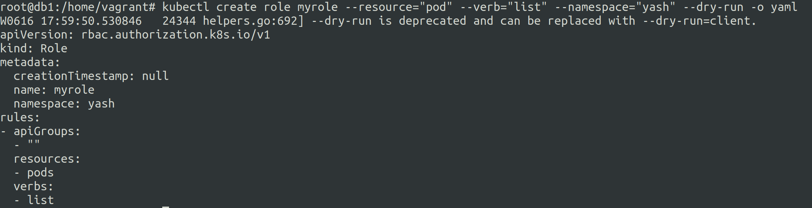
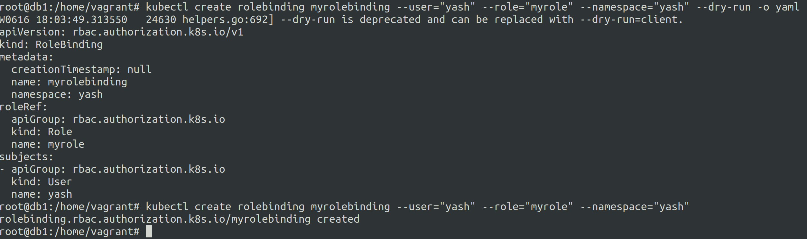

# RBAC Management in k8s.
16 June 2023

***What is RBAC ?***

* Role Based Access Control simply means a set of permissions allowed to particular users in the k8s cluster.


**Role**

* A set of permissions that a user can perform.


**Role can be of two types:-**

1. **role**

    They are set of permissions restricted to a particular namespace.


2. **clusterRole**

    These are the set of permissions over the entire kubernetes cluster, not to a particular namespace.


***How are users assigned roles ?***
---

roles and clusterRoles are linked to users using roleBinding and clusterRoleBinding.

**roleBindings** are for **role**

* These roleBindings bind a role to a particular user in a particular namespace.

**clusterRoleBinding** are for **clusterRole**

* These clusterroleBindings bind a role to a particular user for the entire cluster.

**Generate the role manifest**

```kubectl create role myrole --verb="get","watch" --resource="pods" --dry-run=client -o yaml```




**Generate the rolebinding manifest**

```kubectl create rolebinding myrolebinding --user="yash" --role="myrole" --dry-run=client -o yaml```




### **What exactly do we mean by users and why RBAC ?**

There is no option of user in the kubectl create or any other kubectl command. 

***So what exactly do we mean by these users ?***

Users are defined in the kubeconfig file, they have their own set of keys and certs that are authorized by the control plane for interaction with the cluster.

Now creating a user or group is a complex process altogether which we will discuss in detail later.

For now consider users to be similar to that of linux users with different set of permissions over resources.

The RBAC essentially defines these permissions and user association with it and it is important to do so as everyone should not have admin access to a k8s cluster.

**example:** admins control the entire cluster, dev needs few control restricted to particular namespace, some processes might need some different permissions and so on.


