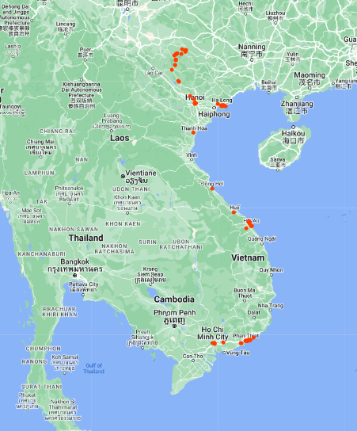

# Nam 2023

This trip was kind of cool.

**Summary**: Travelled from the North to the South of the country.

- Hanoi
- Ha Gian loop
- Ha Long
- Hanoi
- Da Nang
- .. Some places ...
- Ho Chi Minh

**Observations about people.**: 

* People over there are technically skilled.
* Mentality of getting things done.
* Having balls to do scary stuff.
* Kids are even more ballsy.
* Almost everyone is fit. ~ Turkey.
* Tourist friendly.
* Seems like they don't believe in the concept of age. Old folks are also happily working on physical tasks.

**Observations about Country.**: 

* Best road infrastructure.
* No issues from the authorities as everyone follows the rules and regulations.
* Respect and honor for their historic fight.
* Saw most Maybachs, Maseratis, G-wagons and S-Class.
* Money seems to be everywhere in Hanoi.
* Seems like a cool country where anyone with ambition can get ahead.
* Booze was great
* French influence at most places.
* Almost all are trained in arms and fighting. (Mandatory military service after school.)
