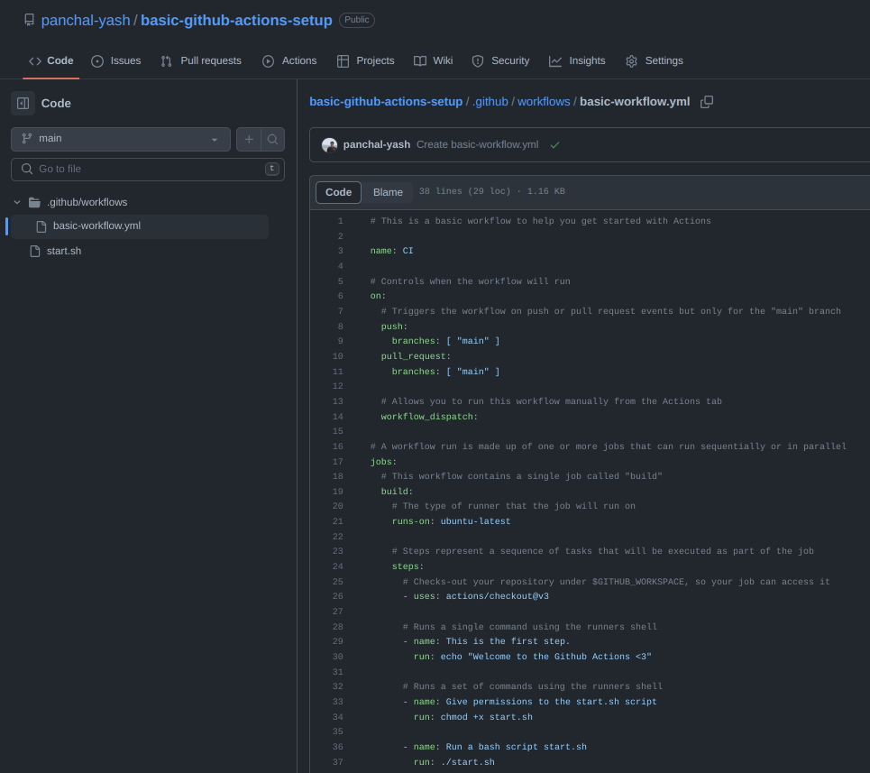

# Github actions might become the keeper <3
17 Jun 2023

Heard a lot about Github Actions, thought it was just another hype.

It is actually kind of cool, heck I think I am falling in love wit this GithubActions setup now <3 .

Usually my day to day activities are on Github and sometimes I setup jenkins locally to automate few stuff, Github Actions provides same setup for Free and without any need to migrate or use another application.

That is all I think I need as of now <3

***Let us setup a basic workflow***
---

So we want a bash script to run whenever a commit is made to the main branch of our repository.

1. Write the bash script
   

2. Write the workflow script.
   

Github actions automatically detects the workflow script, In our case it is located at **.github/workflows/basic-workflow.yml**
