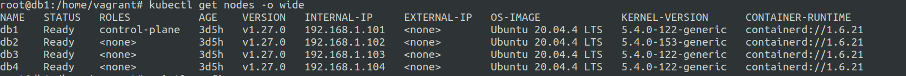
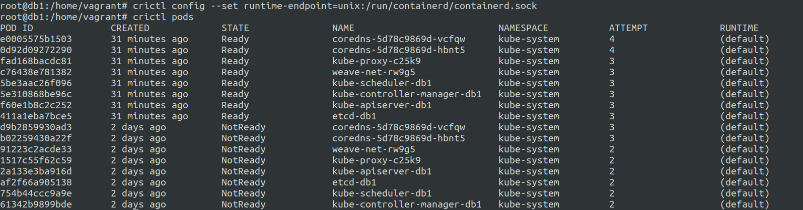

## Some issues encountered during crictl command execution on local k8s setup.

```
root@db1:/home/vagrant# crictl pods
WARN[0000] runtime connect using default endpoints: [unix:///var/run/dockershim.sock unix:///run/containerd/containerd.sock unix:///run/crio/crio.sock unix:///var/run/cri-dockerd.sock]. As the default settings are now deprecated, you should set the endpoint instead. 
E0712 16:57:30.225050    3376 remote_runtime.go:277] "ListPodSandbox with filter from runtime service failed" err="rpc error: code = Unavailable desc = connection error: desc = \"transport: Error while dialing dial unix /var/run/dockershim.sock: connect: no such file or directory\"" filter="&PodSandboxFilter{Id:,State:nil,LabelSelector:map[string]string{},}"
FATA[0000] listing pod sandboxes: rpc error: code = Unavailable desc = connection error: desc = "transport: Error while dialing dial unix /var/run/dockershim.sock: connect: no such file or directory" 
```


The issue is caused due to incorrect configuration.


Before we modify the configuration we need to ensure that which container runtime we are using.


crictl is simply a client interface and we need to ensure that it points to the proper container runtime endpoint. Usually it is a .sock file.

In our case we have containerd.

**How do we check the container runtime ?**
--

Simply run ```kubectl get pods -o wide``` this will show a column named **CONTAINER-RUNTIME** and it will have mention of your contianer runtime.




Now that we know our container runtime, we need to configure the container runtime as the config of the crictl.


we have to set it using 

```crictl config --set runtime-endpoint=unix:/run/containerd/containerd.sock```




Also incase you don't remember which configs to modify look at ```cat /etc/crictl.yaml``` config file.

simple ```crictl``` will also show all the available configs.


