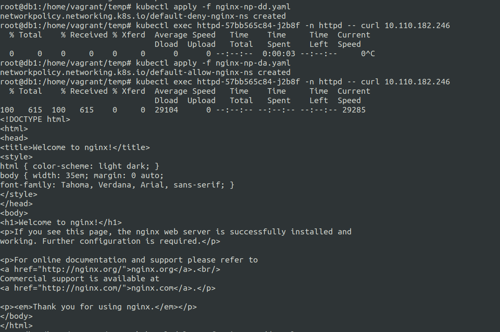

# 1. Network Policies for restricting default access

Allow you to control communication to and from the pods.

There are two types of communication Policies:-
1. Ingress (Into the Pod)
2. Egress  (Out of the Pod)

You can utilize default deny Ingress network policy to block all the incomming traffic to the pod.

**ingress-default-deny-v1.yaml**
```
---
apiVersion: networking.k8s.io/v1
kind: NetworkPolicy
metadata:
  name: default-deny-ingress
spec:
  podSelector: {}
  policyTypes:
  - Ingress
```

**ingress-default-deny-v2.yaml**
```
---
apiVersion: networking.k8s.io/v1
kind: NetworkPolicy
metadata:
  name: default-deny-ingress
spec:
  podSelector: {}
  ingress:
  policyTypes:
  - Ingress
```


**egress-default-deny-v1.yaml**
```
---
apiVersion: networking.k8s.io/v1
kind: NetworkPolicy
metadata:
  name: default-deny-egress
spec:
  podSelector: {}
  policyTypes:
  - Egress
```

**egress-default-deny-v2.yaml**
```
---
apiVersion: networking.k8s.io/v1
kind: NetworkPolicy
metadata:
  name: default-deny-egress
spec:
  podSelector: {}
  egress:
  policyTypes:
  - Egress
```


--- 

**ingress-default-allow.yaml**
```
---
apiVersion: networking.k8s.io/v1
kind: NetworkPolicy
metadata:
  name: default-deny-ingress
spec:
  podSelector: {}
  ingress:
  - {}
  policyTypes:
  - Ingress
```


**egress-default-allow.yaml**
```
---
apiVersion: networking.k8s.io/v1
kind: NetworkPolicy
metadata:
  name: default-deny-egress
spec:
  podSelector: {}
  egress:
  - {}
  policyTypes:
  - Egress
```

Note that Network Policies are additive, so having two Network Policies that select the same Pods will result in allowing both defined policies.

---

### Testing the combo of default deny and default allow on a single pod.

It turnsout that using default deny and default allow on the same pod labels caused the default allow to supersead.

**nginx-np-dd.yaml**
```
---
apiVersion: networking.k8s.io/v1
kind: NetworkPolicy
metadata:
  name: default-deny-nginx-ns
  namespace: nginx
spec:
  podSelector: {}
  policyTypes:
  - Ingress
```

**nginx-np-da.yaml**
```
---
apiVersion: networking.k8s.io/v1
kind: NetworkPolicy
metadata:
  name: default-allow-nginx-ns
  namespace: nginx
spec:
  podSelector: {}
  ingress:
  - {}
  policyTypes:
  - Ingress
```

Applying the above policies.




**Result:** Failed when we applied **nginx-np-dd.yaml** first and it denied our requests. After applying **nginx-np-da.yaml** it allowed our requests.


ref: https://kubernetes.io/docs/concepts/services-networking/network-policies/


# 2. CIS Benchmark using kube-bench


# 3. TLS implementation with Ingress


# 4. Securing Node Endpoints


# 5. Securing GUI Endpoints


# 6. Verifying Kubernetes Binaries

