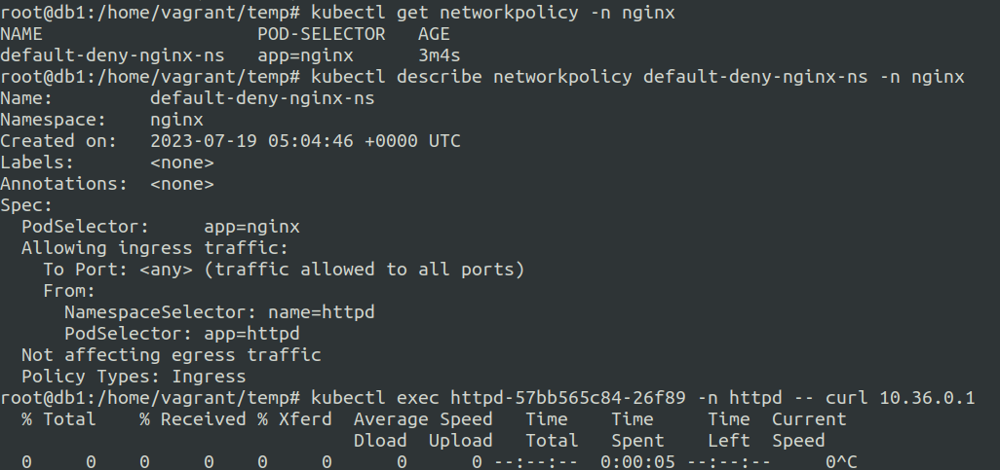
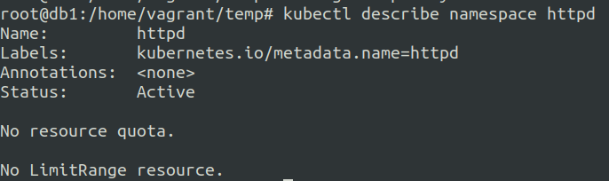
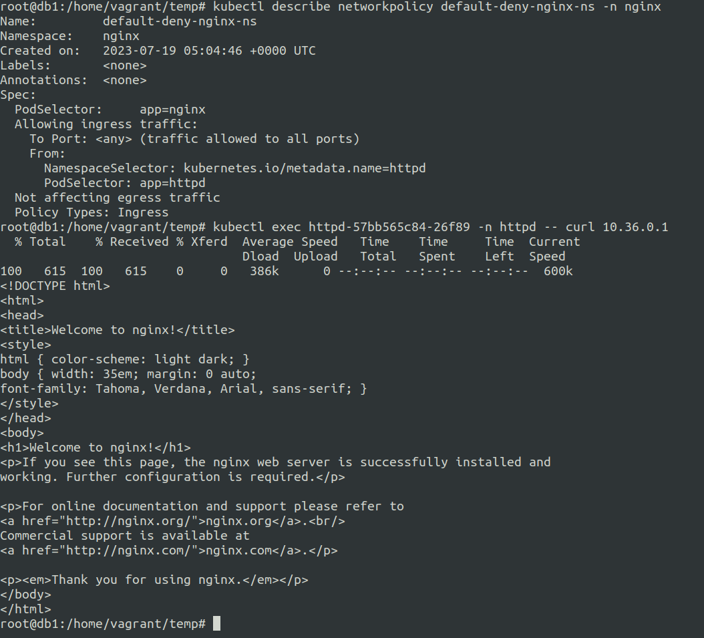
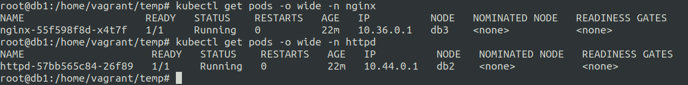
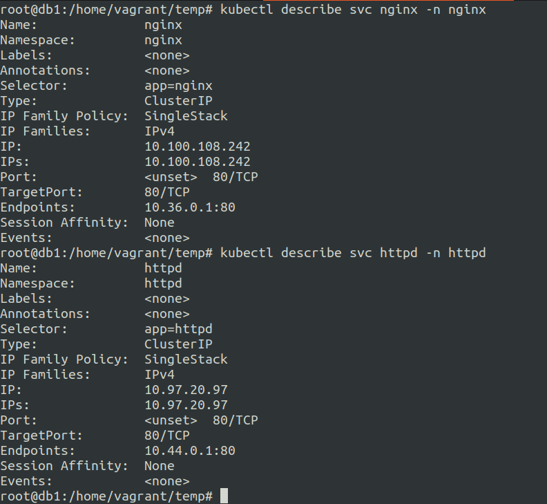
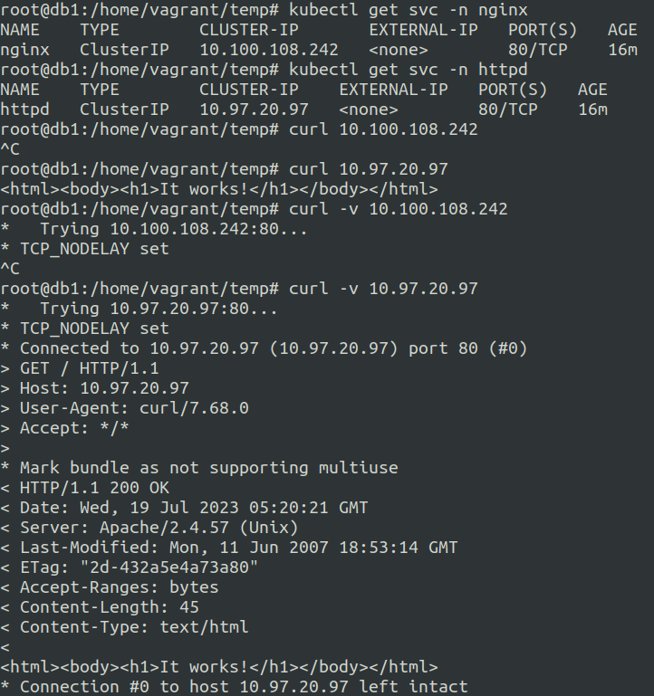
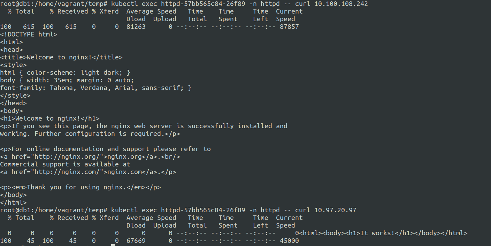
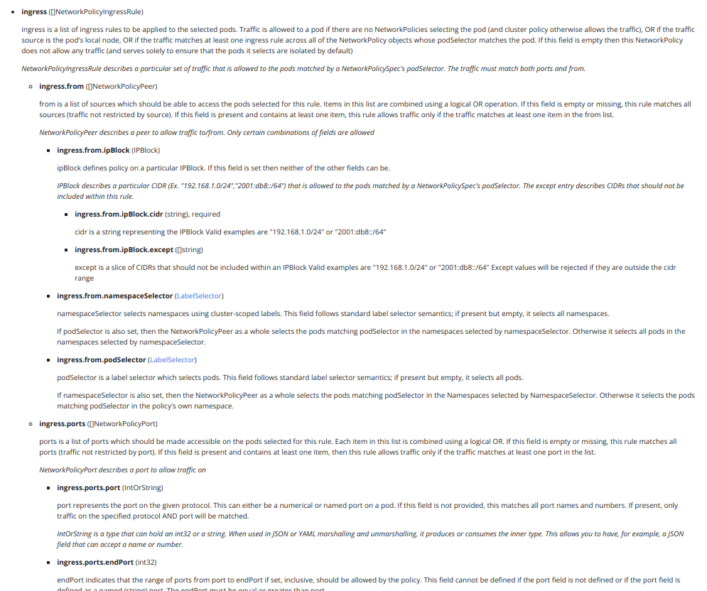

# 1. Network Policies for restricting default access

Allow you to control communication to and from the pods.

There are two types of communication Policies:-
1. Ingress (Into the Pod)
2. Egress  (Out of the Pod)

You can utilize default deny Ingress network policy to block all the incomming traffic to the pod.

**ingress-default-deny-v1.yaml**
```
---
apiVersion: networking.k8s.io/v1
kind: NetworkPolicy
metadata:
  name: default-deny-ingress
spec:
  podSelector: {}
  policyTypes:
  - Ingress
```

**ingress-default-deny-v2.yaml**
```
---
apiVersion: networking.k8s.io/v1
kind: NetworkPolicy
metadata:
  name: default-deny-ingress
spec:
  podSelector: {}
  ingress:
  policyTypes:
  - Ingress
```


**egress-default-deny-v1.yaml**
```
---
apiVersion: networking.k8s.io/v1
kind: NetworkPolicy
metadata:
  name: default-deny-egress
spec:
  podSelector: {}
  policyTypes:
  - Egress
```

**egress-default-deny-v2.yaml**
```
---
apiVersion: networking.k8s.io/v1
kind: NetworkPolicy
metadata:
  name: default-deny-egress
spec:
  podSelector: {}
  egress:
  policyTypes:
  - Egress
```


--- 

**ingress-default-allow.yaml**
```
---
apiVersion: networking.k8s.io/v1
kind: NetworkPolicy
metadata:
  name: default-deny-ingress
spec:
  podSelector: {}
  ingress:
  - {}
  policyTypes:
  - Ingress
```


**egress-default-allow.yaml**
```
---
apiVersion: networking.k8s.io/v1
kind: NetworkPolicy
metadata:
  name: default-deny-egress
spec:
  podSelector: {}
  egress:
  - {}
  policyTypes:
  - Egress
```

Note that Network Policies are additive, so having two Network Policies that select the same Pods will result in allowing both defined policies.

---

### Testing the combo of default deny and default allow on a single pod.

It turnsout that using default deny and default allow on the same pod labels caused the default allow to supersead.

**nginx-np-dd.yaml**
```
---
apiVersion: networking.k8s.io/v1
kind: NetworkPolicy
metadata:
  name: default-deny-nginx-ns
  namespace: nginx
spec:
  podSelector: {}
  policyTypes:
  - Ingress
```

**nginx-np-da.yaml**
```
---
apiVersion: networking.k8s.io/v1
kind: NetworkPolicy
metadata:
  name: default-allow-nginx-ns
  namespace: nginx
spec:
  podSelector: {}
  ingress:
  - {}
  policyTypes:
  - Ingress
```

Applying the above policies.


**Result:** Failed when we applied **nginx-np-dd.yaml** first and it denied our requests. After applying **nginx-np-da.yaml** it allowed our requests.


---

## Scenarios that need careful attention.


### Importance of ensuring that the labels match in an exact way.

In the following example I created following:-

1. two namespaces named **nginx** and **httpd**
2. two deployments named **nginx** in **nginx** namespace another one named **httpd** in the **httpd** namespace
3. two services were created in each namespaces that matached labels for the nginx and httpd pods.

While I was working on defining the network policy for only allowing the traffic from **httpd** pods to the **nginx** pods exclusively, there was one observation.


checking the labels..


The following is the inital network policy definition:-

**nginx-np-dd-failed.yaml**
```
---
apiVersion: networking.k8s.io/v1
kind: NetworkPolicy
metadata:
  name: default-deny-nginx-ns
  namespace: nginx
spec:
  podSelector:
   matchLabels:
    app: nginx
  policyTypes:
  - Ingress
  ingress:
  - from:
    - namespaceSelector:
        matchLabels:
          name: httpd
      podSelector:
        matchLabels:
          app: httpd
```

So in the above network policy for default deny under ingress.from.namespaceSelector.matchLabels we used **name:** as the key for identifying the httpd namespace.

However the network policy did not identify the namespace and so the default deny policy was applied by default resulting in the pod not being accesible.


So we are using name as the key for the httpd namespace under our network policy.



as we can observe we are not able to access the nginx pod even though we have defined the rules under the ingress from the httpd pod and httpd namespace.


Let us now see how the lables are defined for the httpd namespace.



Modifying the network policy based on the namespace label and trying again.



We can now see that we are able to access the pod using curl request.


**nginx-np-dd-working.yaml**
```
---
apiVersion: networking.k8s.io/v1
kind: NetworkPolicy
metadata:
  name: default-deny-nginx-ns
  namespace: nginx
spec:
  podSelector:
   matchLabels:
    app: nginx
  policyTypes:
  - Ingress
  ingress:
  - from:
    - namespaceSelector:
        matchLabels:
          kubernetes.io/metadata.name: httpd
      podSelector:
        matchLabels:
          app: httpd
```

**nginx-service.yaml**
```
apiVersion: v1
kind: Service
metadata:
  name: nginx
  namespace: nginx
spec:
  selector:
    app: nginx
  ports:
    - protocol: TCP
      port: 80
      targetPort: 80
```

**httpd-service.yaml**
```
apiVersion: v1
kind: Service
metadata:
  name: httpd
  namespace: httpd
spec:
  selector:
    app: httpd
  ports:
    - protocol: TCP
      port: 80
      targetPort: 80
```


**nginx-deployment.yaml**

```
apiVersion: apps/v1
kind: Deployment
metadata:
  creationTimestamp: null
  labels:
    app: nginx
  name: nginx
  namespace: nginx
spec:
  replicas: 1
  selector:
    matchLabels:
      app: nginx
  strategy: {}
  template:
    metadata:
      creationTimestamp: null
      labels:
        app: nginx
    spec:
      containers:
      - image: nginx
        name: nginx
        resources: {}
        ports:
        - containerPort: 80
status: {}
```


**httpd-deployment.yaml**
```
apiVersion: apps/v1
kind: Deployment
metadata:
  creationTimestamp: null
  labels:
    app: httpd
  name: httpd
  namespace: httpd
spec:
  replicas: 1
  selector:
    matchLabels:
      app: httpd
  strategy: {}
  template:
    metadata:
      creationTimestamp: null
      labels:
        app: httpd
    spec:
      containers:
      - image: httpd
        name: httpd
        resources: {}
        ports:
        - containerPort: 80
status: {}
```

---

### Network policies and Services.


In the previous example we saw that we need to allow the absolute key related to the namespace and other components for making the network policy work.

Here we will continue with the same above example, but this time we will add services in their respective namespaces.

So there will be 2 services:-

1. nginx service in the nginx namespace.
2. httpd service in the httpd namespace.

**nginx-service.yaml**
```
apiVersion: v1
kind: Service
metadata:
  name: nginx
  namespace: nginx
spec:
  selector:
    app: nginx
  ports:
    - protocol: TCP
      port: 80
      targetPort: 80
```

**httpd-service.yaml**
```
apiVersion: v1
kind: Service
metadata:
  name: httpd
  namespace: httpd
spec:
  selector:
    app: httpd
  ports:
    - protocol: TCP
      port: 80
      targetPort: 80
```
Let us see the pod Ip details



Confirming if the services got the endpoints of the pods or not.




Ok so the services have the endpoints to the pods and we should be able to access the pods via service cluster IP.

Let us see the cluster ips of both these services and attempt to connect to it.



We cannot connect to the nginx pod via nginx service cluster ip 

Let us remove the network policy of nginx and check 



So the issue is with the network policy an we have to find a way to resolve this.

As per the kubernetes api reference for network-policy we only have few options for the ingress ref: https://kubernetes.io/docs/reference/kubernetes-api/policy-resources/network-policy-v1/



We already use podSelector and namespaceSelector so let us now try using ipBlock

And it does not work....

Just confirm will test it on a managed k8s cluster..

Yep tested with a managed service cluster and the setup worked the svc was accessible from the allowed pod inside the namespace to the svc and it worked.

Tried same thing with a different pod in different namespace and it failed.


To confirm it again and officially will set it up on EKS.


ref: https://kubernetes.io/docs/concepts/services-networking/network-policies/


# 2. CIS Benchmark using kube-bench

**CIS Benchmark:** Center for Internet Security Benchmarks are set of best practices for securing kubernetes environments.


**kube-bench** is a tool that checks the cluster for CIS Benchmark metrics.


### How to use kube-bench ?

There are set of manifests provided by auasec kube-bench 

The kube-bench runs a kubernetes job if ran using manifests.

We can also use a kube-bench binary on the node itself.

Of all the available methods my preffered method is installing kube-bench as a container and binary.

```docker run --rm -v `pwd`:/host docker.io/aquasec/kube-bench:latest install```

**ref:** https://github.com/aquasecurity/kube-bench/blob/main/docs/installation.md#download-and-install-binaries


So you now run the kube-bench using simple ```./kube-bench``` command from the binary path.

Use grep to find the failures like:-

```./kube-bench | grep FAIL```

get the id-no and use grep for potential methods for solving the FAILURE.


Remember: You need to install and follow these steps on all the nodes.

---
### Some tricks and tips for kubebench.

The Summary and remediations are arranged into three stages as follows:-

x Summary

x.x Sub topic 

x.x.x Remediation

**Example:-**

```
[INFO] 3 Control Plane Configuration
[INFO] 3.1 Authentication and Authorization
[WARN] 3.1.1 Client certificate authentication should not be used for users (Manual)
[WARN] 3.1.2 Service account token authentication should not be used for users (Manual)
[WARN] 3.1.3 Bootstrap token authentication should not be used for users (Manual)
[INFO] 3.2 Logging
[WARN] 3.2.1 Ensure that a minimal audit policy is created (Manual)
[WARN] 3.2.2 Ensure that the audit policy covers key security concerns (Manual)
```

We can see above that 3 is the main topic, 3.1 is a sub topic while 3.1.1 till 3.1.3 are the remediation topics.


# 3. TLS implementation with Ingress


# 4. Securing Node Endpoints


# 5. Securing GUI Endpoints


# 6. Verifying Kubernetes Binaries

