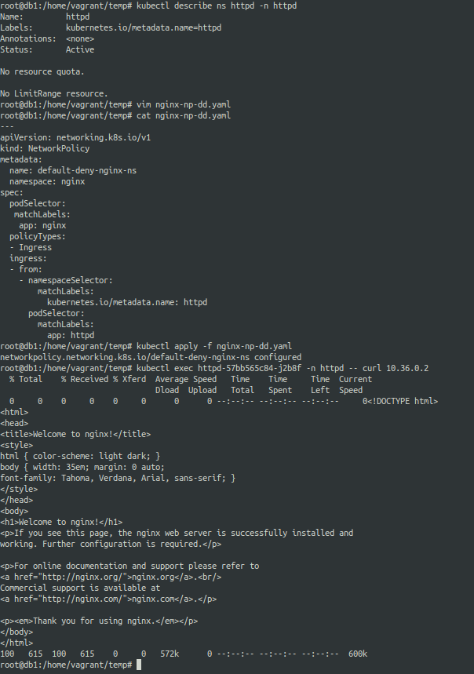

# 1. Network Policies for restricting default access

Allow you to control communication to and from the pods.

There are two types of communication Policies:-
1. Ingress (Into the Pod)
2. Egress  (Out of the Pod)

You can utilize default deny Ingress network policy to block all the incomming traffic to the pod.

**ingress-default-deny-v1.yaml**
```
---
apiVersion: networking.k8s.io/v1
kind: NetworkPolicy
metadata:
  name: default-deny-ingress
spec:
  podSelector: {}
  policyTypes:
  - Ingress
```

**ingress-default-deny-v2.yaml**
```
---
apiVersion: networking.k8s.io/v1
kind: NetworkPolicy
metadata:
  name: default-deny-ingress
spec:
  podSelector: {}
  ingress:
  policyTypes:
  - Ingress
```


**egress-default-deny-v1.yaml**
```
---
apiVersion: networking.k8s.io/v1
kind: NetworkPolicy
metadata:
  name: default-deny-egress
spec:
  podSelector: {}
  policyTypes:
  - Egress
```

**egress-default-deny-v2.yaml**
```
---
apiVersion: networking.k8s.io/v1
kind: NetworkPolicy
metadata:
  name: default-deny-egress
spec:
  podSelector: {}
  egress:
  policyTypes:
  - Egress
```


--- 

**ingress-default-allow.yaml**
```
---
apiVersion: networking.k8s.io/v1
kind: NetworkPolicy
metadata:
  name: default-deny-ingress
spec:
  podSelector: {}
  ingress:
  - {}
  policyTypes:
  - Ingress
```


**egress-default-allow.yaml**
```
---
apiVersion: networking.k8s.io/v1
kind: NetworkPolicy
metadata:
  name: default-deny-egress
spec:
  podSelector: {}
  egress:
  - {}
  policyTypes:
  - Egress
```

Note that Network Policies are additive, so having two Network Policies that select the same Pods will result in allowing both defined policies.

---

### Testing the combo of default deny and default allow on a single pod.

It turnsout that using default deny and default allow on the same pod labels caused the default allow to supersead.

**nginx-np-dd.yaml**
```
---
apiVersion: networking.k8s.io/v1
kind: NetworkPolicy
metadata:
  name: default-deny-nginx-ns
  namespace: nginx
spec:
  podSelector: {}
  policyTypes:
  - Ingress
```

**nginx-np-da.yaml**
```
---
apiVersion: networking.k8s.io/v1
kind: NetworkPolicy
metadata:
  name: default-allow-nginx-ns
  namespace: nginx
spec:
  podSelector: {}
  ingress:
  - {}
  policyTypes:
  - Ingress
```

Applying the above policies.


**Result:** Failed when we applied **nginx-np-dd.yaml** first and it denied our requests. After applying **nginx-np-da.yaml** it allowed our requests.


---

## Scenarios that need careful attention.


### Importance of ensuring that the labels match in an exact way.

In the following example I created following:-

1. two namespaces named **nginx** and **httpd**
2. two deployments named **nginx** in **nginx** namespace another one named **httpd** in the **httpd** namespace
3. two services were created in each namespaces that matached labels for the nginx and httpd pods.

While I was working on defining the network policy for only allowing the traffic from **httpd** pods to the **nginx** pods exclusively, there was one observation.


checking the labels..



The following is the inital network policy definition:-

**nginx-np-dd-failed.yaml**
```
---
apiVersion: networking.k8s.io/v1
kind: NetworkPolicy
metadata:
  name: default-deny-nginx-ns
  namespace: nginx
spec:
  podSelector:
   matchLabels:
    app: nginx
  policyTypes:
  - Ingress
  ingress:
  - from:
    - namespaceSelector:
        matchLabels:
          name: httpd
      podSelector:
        matchLabels:
          app: httpd
```

Modifying the network policy based on the namespace label

**nginx-np-dd-working.yaml**
```
---
apiVersion: networking.k8s.io/v1
kind: NetworkPolicy
metadata:
  name: default-deny-nginx-ns
  namespace: nginx
spec:
  podSelector:
   matchLabels:
    app: nginx
  policyTypes:
  - Ingress
  ingress:
  - from:
    - namespaceSelector:
        matchLabels:
          kubernetes.io/metadata.name: httpd
      podSelector:
        matchLabels:
          app: httpd
```

**nginx-service.yaml**
```
apiVersion: v1
kind: Service
metadata:
  name: nginx
  namespace: nginx
spec:
  selector:
    app: nginx
  ports:
    - protocol: TCP
      port: 80
      targetPort: 80
```

**httpd-service.yaml**
```
apiVersion: v1
kind: Service
metadata:
  name: httpd
  namespace: httpd
spec:
  selector:
    app: httpd
  ports:
    - protocol: TCP
      port: 80
      targetPort: 80
```


**nginx-deployment.yaml**

```
apiVersion: apps/v1
kind: Deployment
metadata:
  creationTimestamp: null
  labels:
    app: nginx
  name: nginx
  namespace: nginx
spec:
  replicas: 1
  selector:
    matchLabels:
      app: nginx
  strategy: {}
  template:
    metadata:
      creationTimestamp: null
      labels:
        app: nginx
    spec:
      containers:
      - image: nginx
        name: nginx
        resources: {}
        ports:
        - containerPort: 80
status: {}
```


**httpd-deployment.yaml**
```
apiVersion: apps/v1
kind: Deployment
metadata:
  creationTimestamp: null
  labels:
    app: httpd
  name: httpd
  namespace: httpd
spec:
  replicas: 1
  selector:
    matchLabels:
      app: httpd
  strategy: {}
  template:
    metadata:
      creationTimestamp: null
      labels:
        app: httpd
    spec:
      containers:
      - image: httpd
        name: httpd
        resources: {}
        ports:
        - containerPort: 80
status: {}
```


ref: https://kubernetes.io/docs/concepts/services-networking/network-policies/


# 2. CIS Benchmark using kube-bench


# 3. TLS implementation with Ingress


# 4. Securing Node Endpoints


# 5. Securing GUI Endpoints


# 6. Verifying Kubernetes Binaries

