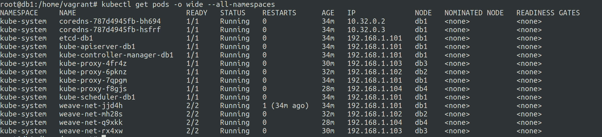
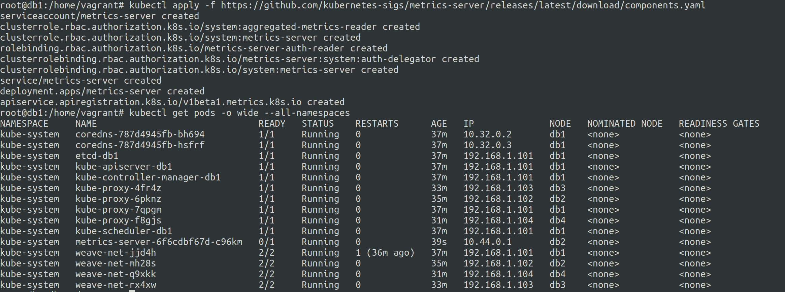
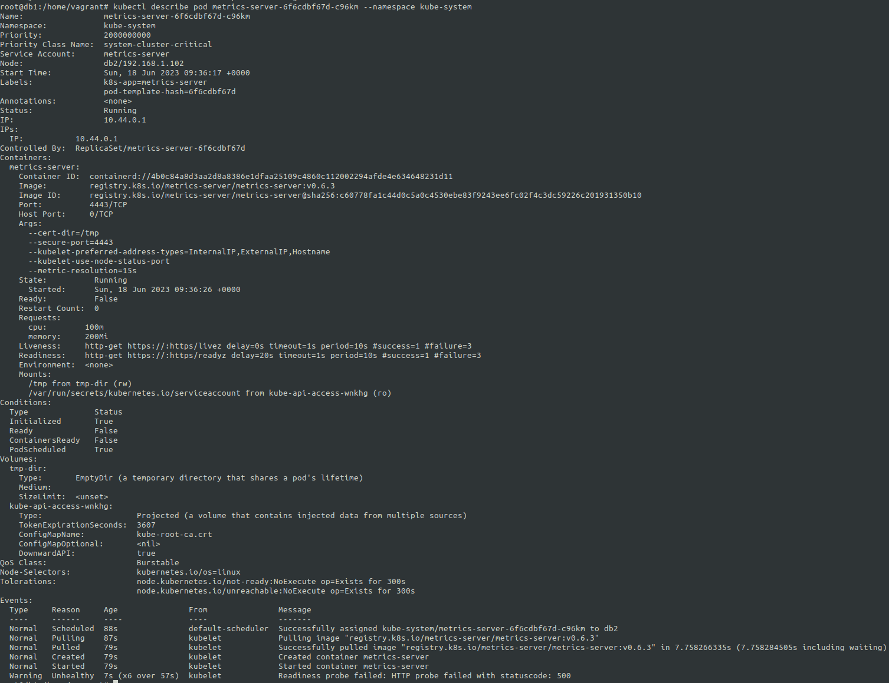
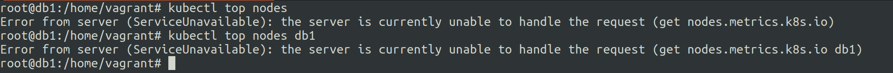
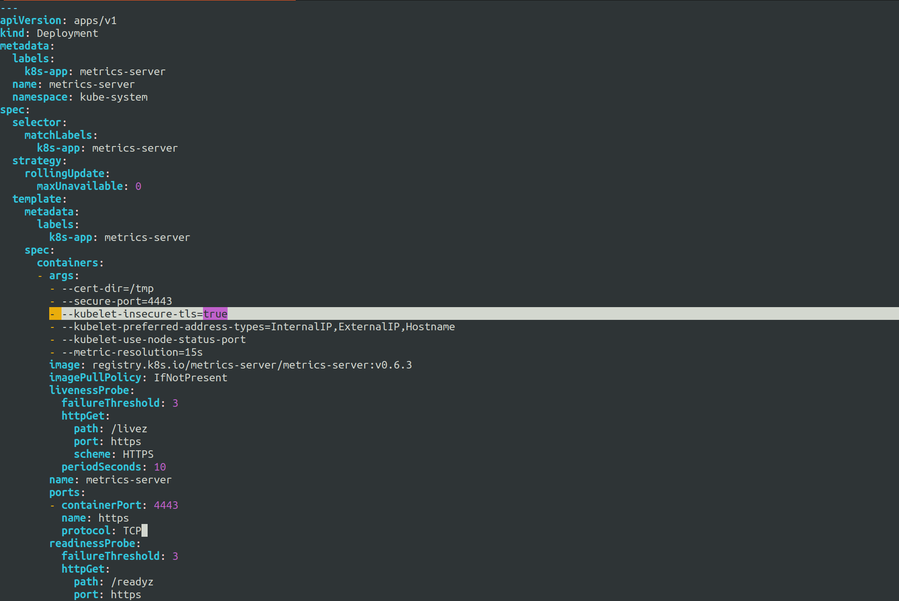
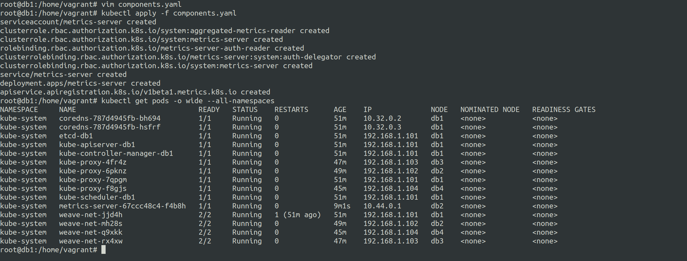
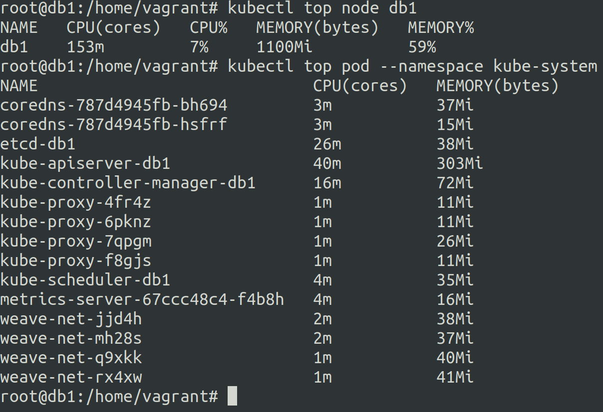

# Kubernetes addons and metrics server
18 June 2023


***What are kubernetes addons ?***
---

k8s addons provide additional functionalities to the kubernetes cluster.


***What is a kubernetes metrics server ?***
---
 
K8s metrics server is an addon that lets you monitor resource usage for pods and nodes using ```kubectl top``` command and has support for ```--sort-by``` and ```--selector```


***Setting up metrics server in local 4 node k8s cluster***

Setup k8s cluster using k8s-1.3 notes.

All pods after the cluster setup.




Setting up metrics server documentation:- https://github.com/kubernetes-sigs/metrics-server

```
kubectl apply -f https://github.com/kubernetes-sigs/metrics-server/releases/latest/download/components.yaml
```



Turnsout it is notworking, let us inspect as to what actually is going on in the pod.



Let us check the ```kubectl top nodes``` command to see what do we get..




Now we need to edit the default component.yaml a little bit

So let us download the file using wget and use vim to edit it.

```
wget https://github.com/kubernetes-sigs/metrics-server/releases/latest/download/components.yaml 

vim components.yaml
```

modify the ```-args``` of ```containers``` in ```spec``` section to include ```--kubelet-insecure-tls=true```




Let us now deploy this modified components.yaml manifest.



We can see that the pod metrics-server is runnning successfully.

Let us further inspect it.


Yes it is up and running.


Now let us confirm if the ```kubectl top``` is working as per expectations.





Yup it is working beautifully like a Baddiee... <3


reference: 

- https://github.com/kubernetes-sigs/metrics-server/releases/tag/v0.6.3

- https://github.com/kubernetes-sigs/metrics-server

- https://kubernetes.io/docs/tasks/debug/debug-cluster/resource-metrics-pipeline/#metrics-server

