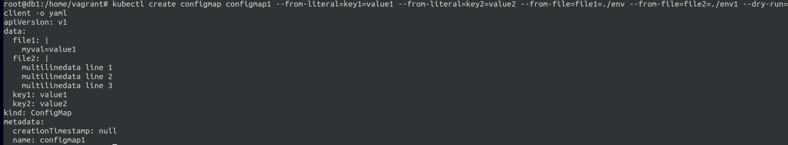
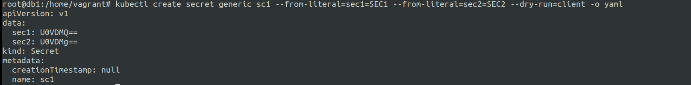
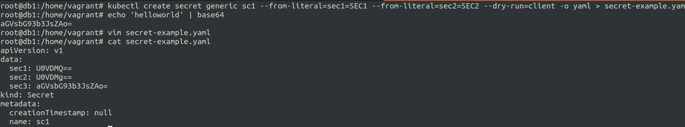
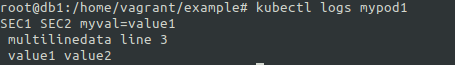
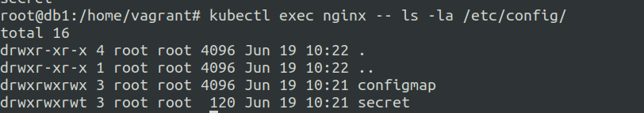
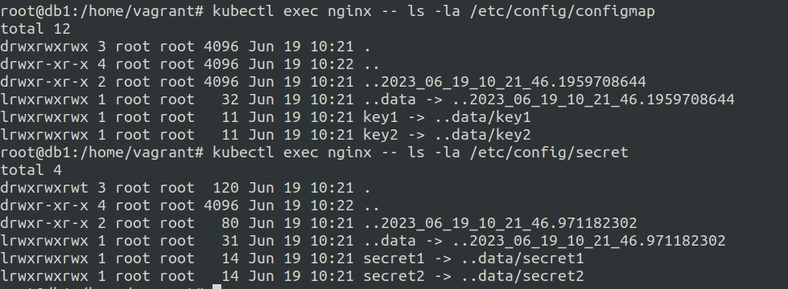

# Application configuration management in kubernetes.
18 June 2023

**Application configuration**; usually there arises a need to pass dynamic configuration to the application during runtime, to control application behaviour.

There are mainly two ways to store the configurations in kuberentes :-

1. **ConfigMaps**

    Key Value maps definition of the configuration data. 
    Stored in the manifest file.
    
    Easy way to generate configmap manifest from the imperative commands.

    ```--from-literal=KEY=VALUE``` This flag allows you to set the values in the configmap file that will be generated as **key: value** format.


    ```--from-file=PATH/TO/FILE/ENV``` This flag allows you to set the env values inside the cofigmap file.


    **Example of both** :- 

    ```
    echo "myval=value1" > env

    echo "multilinedata line 1" > env1
    echo "multilinedata line 2" >> env1
    echo "multilinedata line 3" > env1

    kubectl create configmap configmap1 --from-literal=key1=value1 --from-literal=key2=value2 --from-file=file1=./env --from-file=file2=./env1 --dry-run=client -o yaml
    ```

    you can also have sub keys example:-

    ```
    apiVersion: v1
    data:
    file1: |
        myval=value1
    file2: |
        multilinedata line 1
        multilinedata line 2
        multilinedata line 3
    key1: value1
    key2: value2
    key3: 
        subkey:
            morekeys: data
            evenmorekeys: some more data
    kind: ConfigMap
    metadata:
    creationTimestamp: null
    name: configmap1

    ```
    


2. **Secrets**

    Similar to configmaps, secrets are designed to securely store the data.
    It simply encodes the data to base64 by default when you run imperative command.

    **example**:-

    ```kubectl create secret generic sc1 --from-literal=sec1=SEC1 --from-literal=sec2=SEC2 --dry-run=client -o yaml```

    
    
    encodes directly to the base64 inside to the yaml generated output.

    ```echo 'helloworld' | base64```

    you can now add the output to the secrets manifest manually using vim.


    


---

***How do we use/pass the above configurations that is stored inside the container ?***

The stored configs/secrets are actually utilized as **Environment variables** and then utilized by the application running inside the pods.


Example of a pod manifest on how the configMaps are utilized.


```
spec:
    containers:
    - ...
      env:
      - name: ENVVARIABLE
        valueFrom:
            configMapKeyRef:
                name: my-configmap
                key: mykey

```

In the above example ```ENVVARIABLE``` is passed as an environment variable to the pod.

Let us try with the following example:-

**configmap1** with a literal config and an env file config.

```
 echo "myval=value1" > env

 echo "multilinedata line 1" > env1
 echo "multilinedata line 2" >> env1
 echo "multilinedata line 3" > env1

 kubectl create configmap configmap1 --from-literal=key1=value1 --from-literal=key2=value2 --from-file=file1=./env --from-file=file2=./env1 --dry-run=client -o yaml > configmap1.yaml

 kubectl apply -f configmap1.yaml
```


**sc1** a secret

```
kubectl create secret generic sc1 --from-literal=sec1=SEC1 --from-literal=sec2=SEC2 --dry-run=client -o yaml > sc1.yaml

kubectl apply -f sc1.yaml
```

**mypod1** a pod spec that uses the **sc1** and **configmap1**

**mypod1.yaml**
```
apiVersion: v1
kind: Pod
metadata:
  creationTimestamp: null
  labels:
    run: mypod1
  name: mypod1
spec:
  containers:
  - command: ['sh','-c', 'echo "$sec1 $sec2 $file1 $file2 $key1 $key2"']
    env:
    - name: file1
      valueFrom: 
        configMapKeyRef:
         name: configmap1
         key: file1
    - name: file2
      valueFrom: 
        configMapKeyRef:
         name: configmap1
         key: file2
    - name: key1
      valueFrom: 
        configMapKeyRef:
          name: configmap1
          key: key1
    - name: key2
      valueFrom: 
        configMapKeyRef:
          name: configmap1
          key: key2
    - name: sec1
      valueFrom: 
        secretKeyRef:
          name: sc1
          key: sec1
    - name: sec2 
      valueFrom:
        secretKeyRef:
          name: sc1
          key: sec2
    image: ubuntu
    name: mypod1
    resources: {}
  dnsPolicy: ClusterFirst
  restartPolicy: Always
status: {}
```

So essentially we need to remember that under the ```env:``` level we need to define the env variables with ```name:``` being the ENV variable name.
```valueFrom:``` having two options in our case:-

1. ```secKeyRef:``` for secrets name and key we want to store in the env.
2. ```configMapKeyRef:``` for configmap name and key we want to store in the env.


**Output of the pod exection**




---

**Configuration Volumes** 

The configuration volumes are essentially volume mounts.

Each top level key will be a file with all the keys below that top level keys as file content.

So here you defined ```configMap:```/```secret:``` as volumes.


**Example (under pod spec) :**

**nginx.yaml**
```
apiVersion: v1
kind: Pod
metadata:
  creationTimestamp: null
  labels:
    run: nginx
  name: nginx
spec:
  containers:
  - name: nginx
    image: nginx
    volumeMounts:
    - name: configmap-volume
      mountPath: /etc/config/configmap
    - name: secret-volume
      mountPath: /etc/config/secret
  volumes:
    - name: configmap-volume
      configMap:
        name: my-configmap
    - name: secret-volume
      secret:
        secretName: my-secret
```

Creating configMap named ```my-configmap```.

```
 kubectl create configmap my-configmap --from-literal=key1=value1 --from-literal=key2=value2 --dry-run=client -o yaml > my-configmap.yaml

kubectl apply -f my-configmap.yaml
```

Creating secret named ```my-secret```.


```
kubectl create secret generic my-secret --from-literal=secret1=value1 --from-literal=secret2=value2 --dry-run=client -o yaml > my-secret.yaml

kubectl apply -f my-secret.yaml
```

Checking the mounted secrets and configmaps :-




