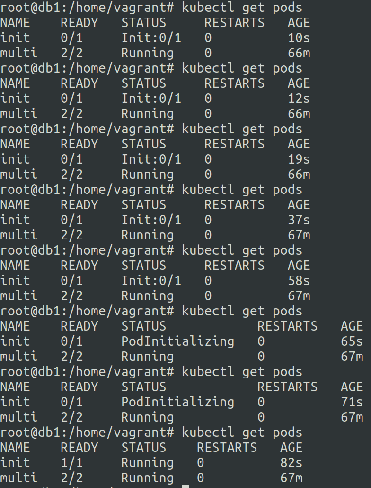

# Init containers in Kubernetes
20 June 2023
Init containers run once during startup. There can be any number of init containers in a pod and they run in order.

init container 1 > init container 2 > main app container 

Init containers are mainly used to offload tasks from the main app container to make things more simple and light.


**Use cases:**

make pods wait before startup of other services in the cluster.

perform few steps before the main app container startup.

populate data that will be used by main app container.

communication with other services before startup of the main app container.


**example**:

```
apiVersion: v1
kind: Pod
metadata:
  creationTimestamp: null
  labels:
    run: init
  name: init
spec:
  containers:
  - image: nginx
    name: init
    resources: {}
  initContainers:
  - name: delay
    image: busybox
    command: ['sleep','60']
  dnsPolicy: ClusterFirst
  restartPolicy: Always
status: {}
```




search_query: initcontainers

ref: https://kubernetes.io/docs/concepts/workloads/pods/init-containers/
