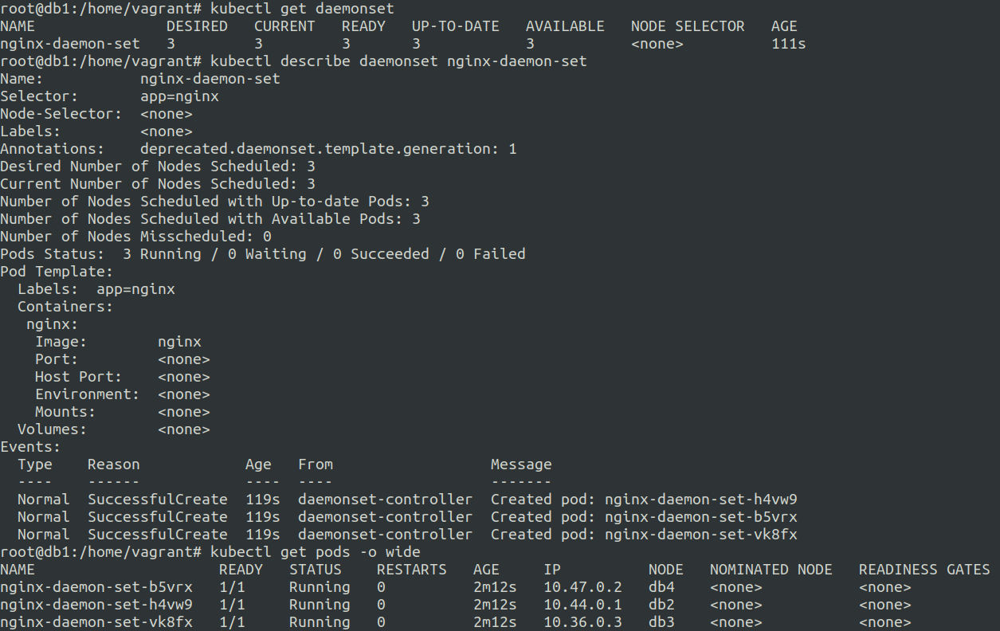

# Daemonset in kubernetes
20 June 2023

Daemonset ensures that all the available worker nodes have a copy of a Pod.

As new nodes are added the pods of daemonset are added to them.

Daemonsets follow the regular scheduling rules and if the scheduling rules don't allow pods to run on a particular node then the daemonset will respect scheduling rule and won't assign pod to it.

**Usage :**

logs collection

node monitoring


```
apiVersion: apps/v1
kind: DaemonSet
metadata:
  name: nginx-daemon-set
spec:
  selector:
    matchLabels:
      app: nginx
  template:
    metadata:
      labels:
        app: nginx
    spec:
      containers:
      - name: nginx
        image: nginx
```




**search_query**: daemonset

**ref**: https://kubernetes.io/docs/concepts/workloads/controllers/daemonset/
