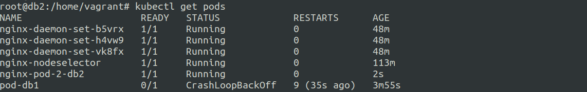

# Static pods in kubernetes
20 June 2023


Static pods are created by the kubelet directly without any usage of kubectl api.


**How do we do this ?**

This is actully due to a default path where if you keep a manifest file the kubelet picks it up and applies it.


path: ```/etc/kubernetes/manifests```


Example:

```kubectl run nginx-pod-2 --image nginx --dry-run=client -o yaml > /etc/kubernetes/manifests/nginx-pod-2.yaml```

Doing this on control plane node will not work as they are tainted by default.


On creating the file on db2 (worker ndoe) it works.



These pods that are visible to us using ```kubectl get pods``` are called mirror pods which are created by kubelet for interface purpose.
