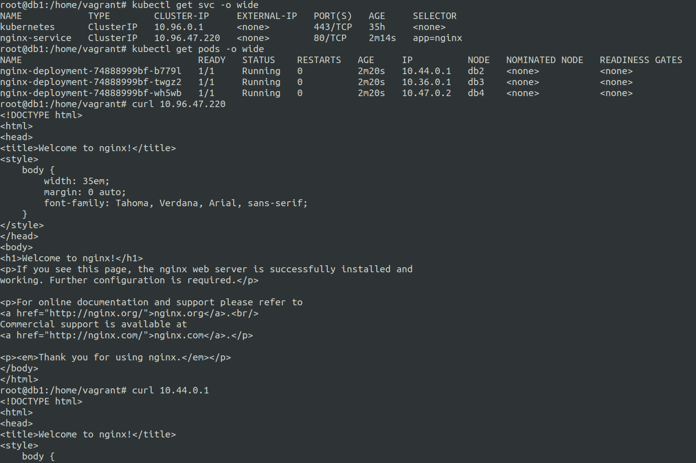
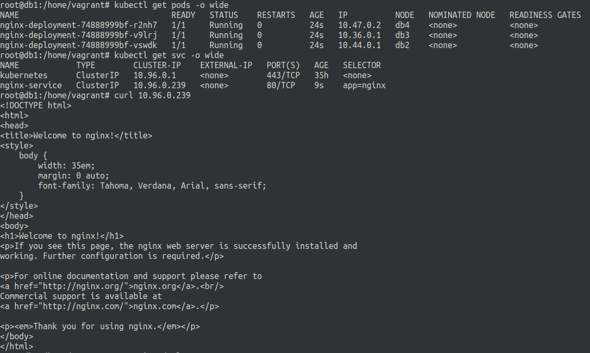
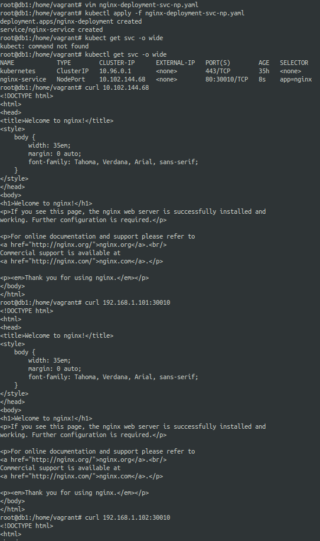

# Services in kubernetes
21 June 2023

A kubernetes object.

Provides abstraction over a set of running pods.

clients can access using services which loadbalance the requests to the pods.


**endpoints**: backend entities where services route traffic.

each pod will be the endpoint of the service.

**Basic service definition**

```
apiVersion: v1
kind: Service
metadata:
  name: my-service
spec:
  selector:
    app.kubernetes.io/name: MyApp
  ports:
    - name: name-of-service-port
      protocol: TCP
      port: 80
      targetPort: 9376
```

Service have ports under its specification, where 4 main things are defined:-

1. **name:** Is an identifier for ports that will be defined.
2. **protocol:** It can be either TCP/UDP based on requirement.
3. **port:** The port on the service.
4. **targetPort:**  The port/name on the endpoint/pod.

```
apiVersion: v1
kind: Pod
metadata:
  name: nginx
  labels:
    app.kubernetes.io/name: proxy
spec:
  containers:
  - name: nginx
    image: nginx:stable
    ports:
      - containerPort: 80
        name: http-web-svc

---
apiVersion: v1
kind: Service
metadata:
  name: nginx-service
spec:
  selector:
    app.kubernetes.io/name: proxy
  ports:
  - name: name-of-service-port
    protocol: TCP
    port: 80
    targetPort: http-web-svc
```

In the above example the ```targetPort``` is ```http-web-svc``` that is a port on the pod defined above the service manifest.

This means that any TCP request on port 80 of the service ```nginx-service``` will route requests to the endpoints that are pods named ```nginx``` on port 80.


We can also have services without selectors, for now we will focus on the basic types of services.


**Types of Services :**
---

There mainly 3 types of services :-


**1. clusterIP**
---

Exposes application inside the cluster.

Use case involves using it when user/consumer of the service is within the cluster.

user/consumer is usually another pod or service within the cluster.

***Basic example of a k8s service along with a nginx deployment manifest.***

**nginx-deployment-svc.yaml**
```
apiVersion: apps/v1
kind: Deployment
metadata:
  name: nginx-deployment
  labels:
    app: nginx
spec:
  replicas: 3
  selector:
    matchLabels:
      app: nginx
  template:
    metadata:
      labels:
        app: nginx
    spec:
      containers:
      - name: nginx
        image: nginx:1.14.2
---
apiVersion: v1
kind: Service
metadata:
  name: nginx-service
spec:
  selector:
    app: nginx
  ports:
  - name: name-of-service-port
    protocol: TCP
    port: 80
    targetPort: 80
```



If we dont define ```  type: NodePort``` it is automatically considered to be a service with ```clusterIp```

We can also manually set cluster IP under the pod range

Let us set the clusterIP to ```10.96.0.239``` as follows :-

**nginx-deployment-clusterip-custom.yaml**

```
apiVersion: apps/v1
kind: Deployment
metadata:
  name: nginx-deployment
  labels:
    app: nginx
spec:
  replicas: 3
  selector:
    matchLabels:
      app: nginx
  template:
    metadata:
      labels:
        app: nginx
    spec:
      containers:
      - name: nginx
        image: nginx:1.14.2
---
apiVersion: v1
kind: Service
metadata:
  name: nginx-service
spec:
  clusterIP: 10.96.0.239
  selector:
    app: nginx
  ports:
  - name: name-of-service-port
    protocol: TCP
    port: 80
    targetPort: 80
```




---

**2. nodePort**
---

Exposes service outside the cluster network.

For accessing the cluster from outside the cluster.

Exposes the service on each node.

Also has a cluster Ip as well. 

The ports are binded to the worker and control nodes.

***Basic example of a nodePort service***

**nginx-deployment-svc-np.yaml**

```
apiVersion: apps/v1
kind: Deployment
metadata:
  name: nginx-deployment
  labels:
    app: nginx
spec:
  replicas: 1
  selector:
    matchLabels:
      app: nginx
  template:
    metadata:
      labels:
        app: nginx
    spec:
      containers:
      - name: nginx
        image: nginx:1.14.2
---
apiVersion: v1
kind: Service
metadata:
  name: nginx-service
spec:
  type: NodePort
  selector:
    app: nginx
  ports:
  - name: name-of-service-port
    protocol: TCP
    port: 80
    nodePort: 30010
```

When we use node port all nodes in the cluster have the nodePort exposed, in the above example port 30010 on db1,db2,db3 and db4 was accessible from outside the cluster.

```
db1 has 192.168.1.101
db2 has 192.168.1.102
db3 has 192.168.1.103
db4 has 192.168.1.104
```

nginx service is accessible to all of the above using curl at port 30010.

The svc is also accesible by its cluster ip as well in our case it was 10.102.144.68 at port 80 for the nginx application.




**3. LoadBalancer Services**
---

Expose service outside the cluster network.

Uses the cloud provider load balancer. Usually involving load balancing functionality.


**search_query:** cluster ip

**ref:** https://kubernetes.io/docs/concepts/services-networking/service/

