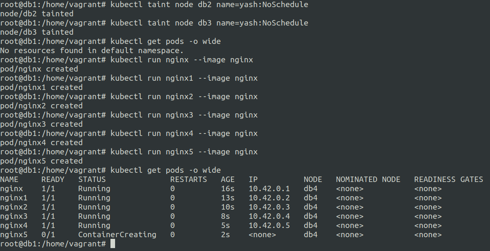
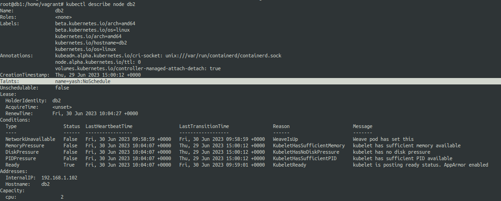
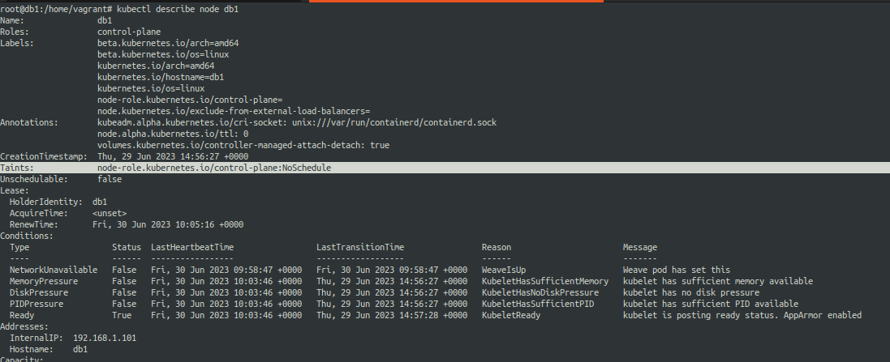
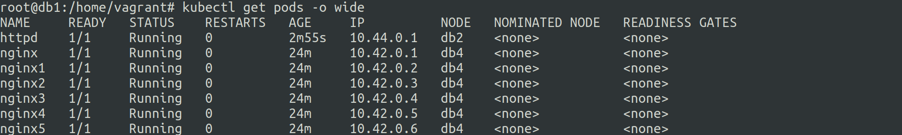
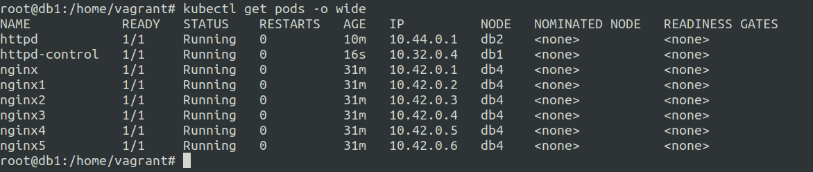
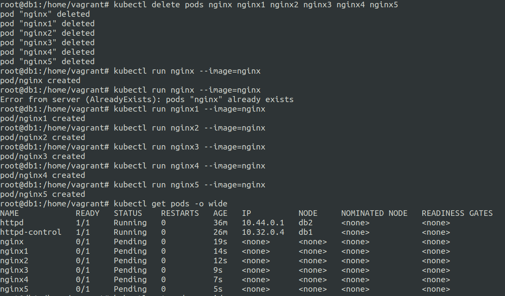
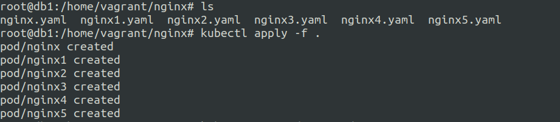
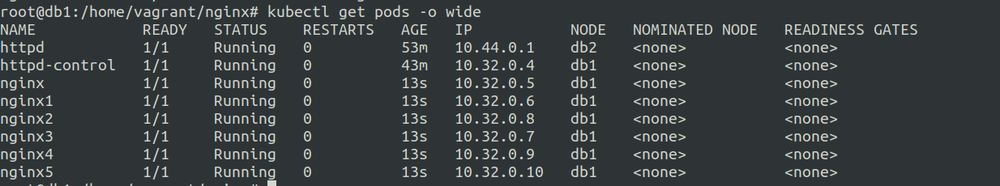

# Taints and Tolerations in kubernetes


**Taints**
---

Similar to labels but pods understand to avoid tainted nodes by default unless the pods have toleration towards it. 

Kind of like a repellent by default, unless there is some explicit toleration towards it.


**Tolerations**
---

The tolerations defined on pods make the pods tolerant to be scheduled on the specified tainted node.

Note: tolerations do not make a pod exclusive to the tainted node, infact it simply means that the pod with toleration towards a taint can be scheduled on the tainted node as well as the other normal nodes.


***Example of a simple taint***
---

**The Setup**

* A 4 node cluster 
* 1 Control Plane
* 3 Worker Nodes

**We will taint 2 worker nodes out the the 3**

Let us taint the 2 worker nodes using ```kubectl taint node db2 name=yash:NoSchedule``` and ```kubectl taint node db3 name=yash:NoSchedule```

Once we tainted the nodes let us run 5 pods of nginx and see the result.



As you can see all the 5 nginx pods are scheduled and running on the db4 node. This db4 node was the only node that was not tainted.

Let us see how our assinged taint looks like on db2 node.




**Wait we did not taint the control plane node, then why are pods not being scheduled over there ?**

Well by default kubernetes taints the control plane node with a default taint.

Let us see how it looks..




---


***Example of a Simple Toleration***
---


Now that we have taints setup on the two nodes **db2** and **db3** let us allow toleration for the taint for a new pod.


**toleration.yaml**

```
apiVersion: v1
kind: Pod
metadata:
  creationTimestamp: null
  labels:
    run: httpd
  name: httpd
spec:
  containers:
  - image: httpd
    name: httpd
    resources: {}
  tolerations:
  - key: "name"
    operator: "Equal"
    value: "yash"
    effect: "NoSchedule"

  dnsPolicy: ClusterFirst
  restartPolicy: Always
status: {}
```

on applying the above manifest we get a pod running on db2.




***Tolerations are pod specific.***


***Example of a toleration for scheduling pod on control plane node***
---


By default a control plane node has a taint. 

Let us use tolerations to schedule and run a pod on the control plane node.


**control-plane-toleration.yaml**

```
apiVersion: v1
kind: Pod
metadata:
  creationTimestamp: null
  labels:
    run: httpd-control
  name: httpd-control
spec:
  containers:
  - image: httpd
    name: httpd-control
    resources: {}
  tolerations:
  - key: "node-role.kubernetes.io/control-plane"
    operator: "Exists"
    effect: "NoSchedule"
  dnsPolicy: ClusterFirst
  restartPolicy: Always
status: {}
```

Ok so it got scheduled on db4 node. Now it was because toleration does not necessarily mean that the pods will be scheduled on the taints that are tolerated.

So inorder to schedule it on db1(control plane) I decided to add a taint on the db4 so now we have all worker nodes tainted.

The pod should now be scheduled on the db1(control plane) node.



Now the other pods are still running on db4 even though it is tainted ?


remember we used effect of ```NoSchedule``` in our taints this simply means no scheduling.

Once you have something that is scheduled this policy does not do anything. unless you delete the pods and redeploy them.

let us see what happens after we delete and rerun the pods.




Ok so lets delete these and create a file for each pod.

**nginx-cp-toleration.yaml**

```
apiVersion: v1
kind: Pod
metadata:
  creationTimestamp: null
  labels:
    run: nginx
  name: nginx
spec:
  containers:
  - image: nginx
    name: nginx
    resources: {}
  tolerations:
  - key: "node-role.kubernetes.io/control-plane"
    operator: "Exists"
    effect: "NoSchedule"
  dnsPolicy: ClusterFirst
  restartPolicy: Always
status: {}
```







search_query: tolerations

ref: https://kubernetes.io/docs/concepts/scheduling-eviction/taint-and-toleration/
