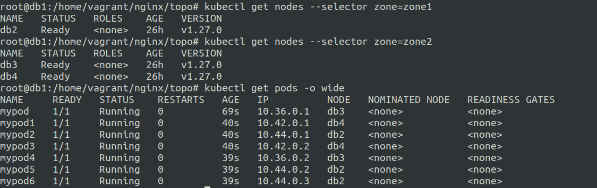

# Topology Spread Constraints.


Control how pods are spread across your cluster.

Specify the spread


example-template.yaml

```
---
apiVersion: v1
kind: Pod
metadata:
  name: example-pod
spec:
  # Configure a topology spread constraint
  topologySpreadConstraints:
    - maxSkew: <integer>
      minDomains: <integer> # optional; beta since v1.25
      topologyKey: <string>
      whenUnsatisfiable: <string>
      labelSelector: <object>
      matchLabelKeys: <list> # optional; beta since v1.27
      nodeAffinityPolicy: [Honor|Ignore] # optional; beta since v1.26
      nodeTaintsPolicy: [Honor|Ignore] # optional; beta since v1.26
  ### other Pod fields go here
```


- maxSkew: degree of uneveness of the pod placement.

- topologyKey: labels that all pods should have (region=regionA) kind of like a lable key. 

- whenUnsatisfiable: what to do when the constraints are not satisfied, either: schedule or donotschedule.

- labelSelector: helps in keeping track of the other pods on node.

- matchLabelKeys: match additional labels in the other pods.

- nodeAffinityPolicy: honor the policy or ignore it.

- nodeTaintsPolicy: honor the policy or ignore it.

---


**Single pod on all the nodes**
---

So we have a 4 node cluster with 1 control plane node.

Let us remove the default taint and all the taints from all the nodes.

Essentially we have now 4 nodes where pods can be scheduled normally.


Let's divide these 4 nodes in to two groups :-

zone1 and zone2

So we will use labels to do this.

```
kubectl label node db1 zone=zone1
kubectl label node db2 zone=zone1

kubectl label node db3 zone=zone2
kubectl label node db4 zone=zone2

```


a little fuckup.

The pods are not being scheduled on the control plane node.

though the pods are scheduled on the worker nodes evenly.


--- 


Let's divide these 3 nodes in to two groups :-

zone1 and zone2

So we will use labels to do this.

```
kubectl label node db2 zone=zone1

kubectl label node db3 zone=zone2
kubectl label node db4 zone=zone2
```


**topology.yaml**

```
kind: Pod
apiVersion: v1
metadata:
  name: mypod
  labels:
    app: mypod 
spec:
  topologySpreadConstraints:
  - maxSkew: 1
    topologyKey: zone
    whenUnsatisfiable: DoNotSchedule
    labelSelector:
      matchLabels:
        app: mypod
  containers:
  - name: pause
    image: registry.k8s.io/pause:3.1
```

So I created 6 similar pod files with diffent name as mypod1 and label for creating 6 similar pods.


