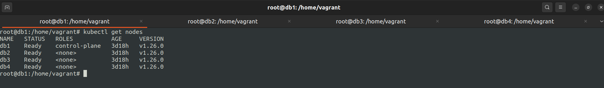
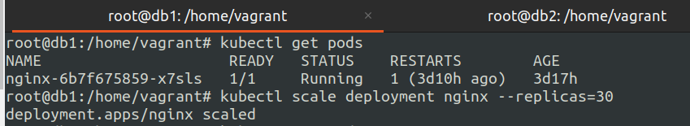
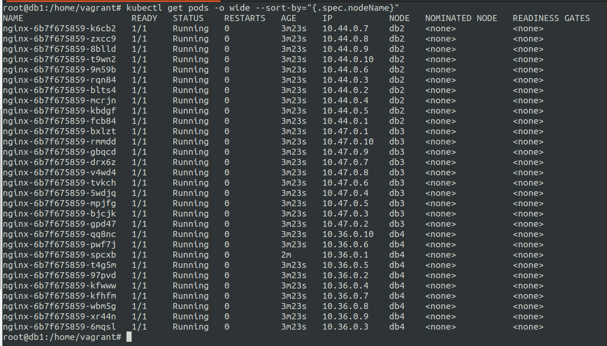
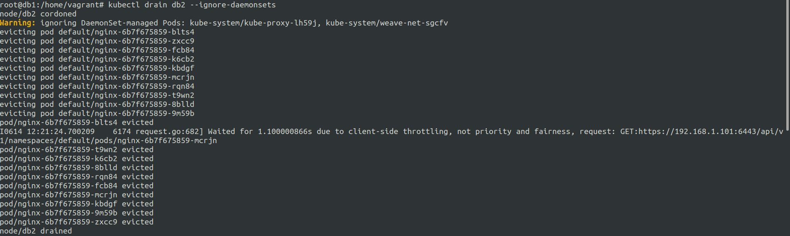
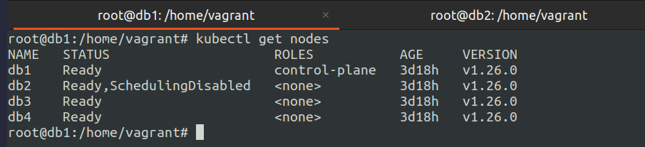
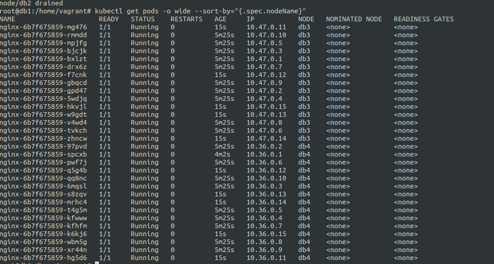
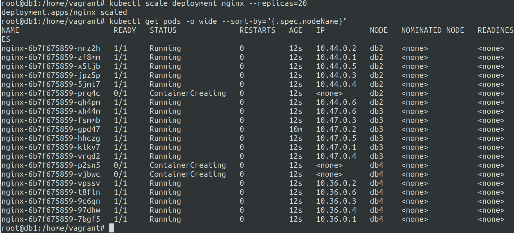

# drain and uncordon Kubernetes Nodes 
14 June 2023


---

**What is draining ?**
---

* Process of removal of a node from the kubernetes cluster temporarily.
* Nodes are usually drained for maintenance or for performing some fixes on the particular node.


* Containers are gracefully terminated and moved to other node.


```
kubectl drain NODE_NAME --ignore-daemonsets
``` 


```--ignore-daemonsets``` is a flag to ignore the daemonset pods on the node that is to be drained.


---

**What is uncordoning ?**
---

* Process of allowing nodes to run on the drained node once again.

```
kubectl uncordon NODE_NAME
```


---

**Example of draining and uncordoning**
---

We will require a 4 node kubernetes cluster with 1 control plane node and 3 worker nodes.

These nodes are named as db1, db2, db3, db4 respectively.

***what are we gonna do ?***
---

1. First we will setup 4 node k8s cluster and 
2. Run nginx deployment with 1 pod and scale to 30 pods.
3. Check the deployment over the 3 worker nodes, Pods distribution over them.
4. Drain the db2 node.
5. Check the cluster status and pods distribution after draining.
6. Scale the pods to 50 to check their assignment over db3 and db4.
7. Uncordon the db2 node.
8. Scale down the pods to 1 abd scale up the pods to 20 to verify if db2 is uncordoned.

---


Setup a 4 node kubernetes cluster using the following guide :- 
https://panchalhimself.github.io/docs/technical/Notes/k8s/k8s-1.3-initialize-and-setup-k8s-cluster.html

**1. Check the 4 node setup setup.**

```kubectl get nodes``` command for checking the cluster status.



**2. Check the single pod nginx deployment and scale to 30 pods.**

``` kubectl get pods ``` get list of pods

``` kubectl scale deployment nginx --replicas=30``` to scale the pods to 30 pods from 1 pod.



**3. Check the status of the pods over the cluster (sorted by node name)**

```kubectl get pods -o wide --sort-by="{.spec.nodeName}"```



**4. drain the node db2**

```kubectl drain db2 --ignore-daemonsets```



**5. Check the status of the cluster after draining**

```kubectl get nodes```



**6. Check the status of the pods after draining (sorted by node name) and scale up to 50 pods**

```kubectl get pods -o wide --sort-by="{.spec.nodeName}"```

we can observer that all the pods from db2 node have been distributed to db3 and db4 nodes.

On further scaling the pods are assigned to db3 and db4 nodes.

``` kubectl scale deployment nginx --replicas=50``` to scale the pods to 50 pods from 30 pod.




**7. Uncordon the db2 node**

```kubectl uncordon db2```

**8. Scale down the pods and back up to 20**

``` kubectl scale deployment nginx --replicas=30``` to scale the pods to 1 pods from 50 pods.

To check if the db2 node is working as normal we scale down the pods to 1, then we will scale the pods to 20.


