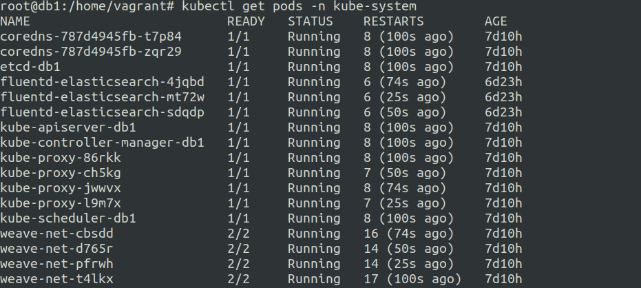
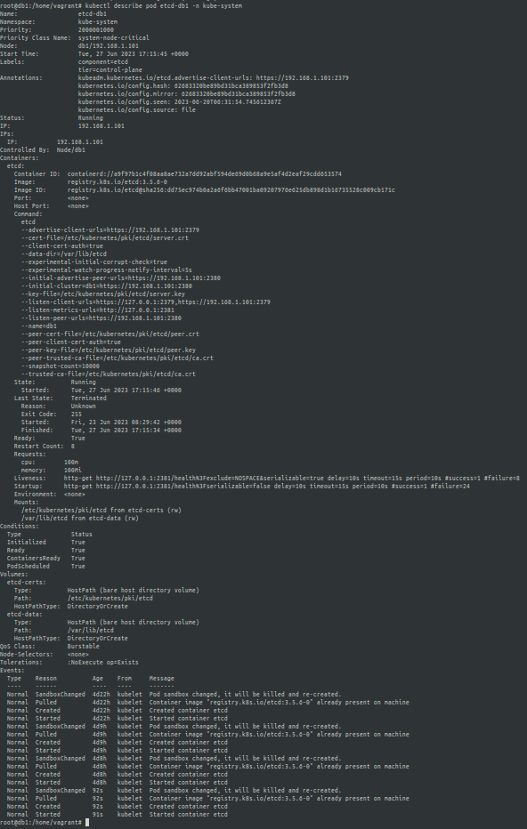
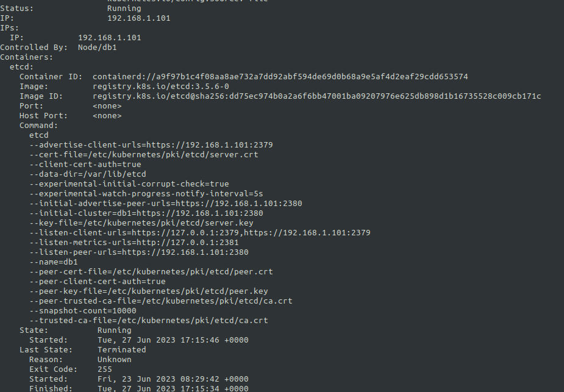
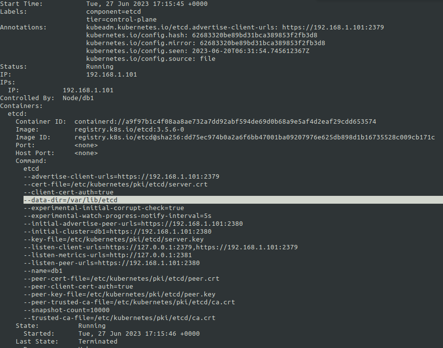
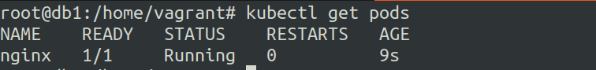
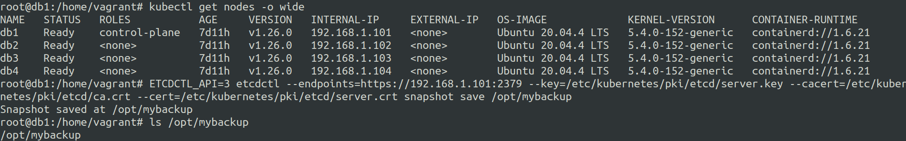
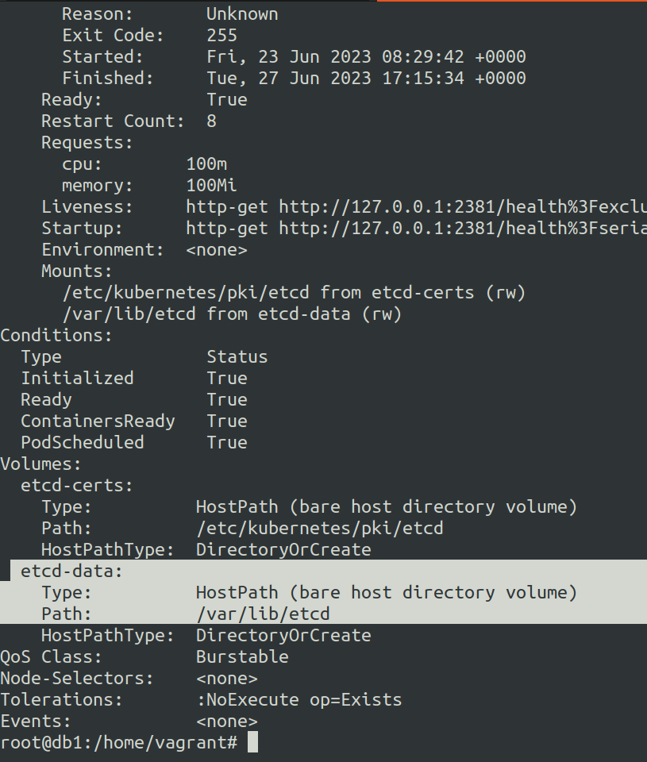
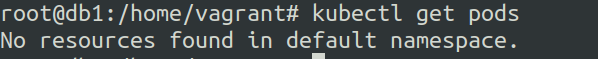

# Backup and Restore k8s cluster data using etcd
16 June 2023


**etcd** is one of the core k8s components that stores cluster data.


***So what are we going to do ?***
---

1. We will manually backup the etcd cluster data to a file.

2. Delete the etcd data dir and make it corrupt. 

3. Restore the etcd cluster data from the backedup file.


We will utilze **etcdctl** utility to perform the backup and restore.

---

We will setup the 3 node k8s cluster from the k8s-1.4 notes.

**Fetch the cluster name : -**

```
ETCDCTL_API=3 \
etcdctl get cluster.name \
--endpoints=https://IP_CONTROL_NODE:2379 \
--cacert=/PATH/TO/THE/etcd-ca.pem \
--cert=/PATH/TO/THE/etcd-server.crt \
--key=/PATH/TO/THE/etcd-server.key
```

**Backup the cluster data : -**

```
ETCDCTL_API=3 \
etcdctl snapshot save /PATH/TO/SAVE/BACKUPS \
--endpoints=https://IP_CONTROL_NODE:2379 \
--cacert=/PATH/TO/THE/etcd-ca.pem \
--cert=/PATH/TO/THE/etcd-server.crt \
--key=/PATH/TO/THE/etcd-server.key
```

Note: the above steps are executed from the etcd installation

However when you have etcd running as a pod in the cluster, you can checkout the path of the ```--cacert, --cert, --key ``` using ```kubectl describe``` on the etcd pod in the kube-system namespace.

**etcd pod**


**etcd pod describe**


**etcd pod describe the path to**  ```--cacert, --cert, --key ```



---

**restore the etcd data dir using the stored file backups**
--

You can restore the etcd cluster data using ```etcdctl restore /PATH/OF/BACKUP/FILE``` command on the etcd data dir.


Now where is this etcd data dir on the cluster if it is running as a pod ?
---

**etcd data dir**



In the above case the etcd data dir is located at ``/var/lib/etcd``` on the control plane node.

so in order to restore the backup properly you need to go to the etcd data dir and run the ```etcdctl restore /PATH/OF/BACKUP/``` command.

This will create a folder whose content we need to move to the ```/var/lib/etcd```

by default there is a folder named **member** at ```/var/lib/etcd``` which we need to replace with the one generated using ```etcdctl restore /PATH/OF/BACKUP/``` command.

or 

**the most easiest and fastest way is using the command**
```
ETCDCTL_API=3 etcdctl --endpoints=https://192.168.1.101:2379 --key=/etc/kubernetes/pki/etcd/server.key --cacert=/etc/kubernetes/pki/etcd/ca.crt --cert=/etc/kubernetes/pki/etcd/server.crt snapshot restore /opt/mybackup
```

--- 

***Example of a simple backup and restore***
---

So in this example we will do the following:-

1. Take initial backup of the etcd cluster with 0 pods running in the default namespace.

2. Run 1 pod.

3. Restore the etcd cluster to the initial backup state.


Now if you are in the control node chances are that you might not have etcd-client installed on the node as etcd is running inside a pod.

To keep things quick and easy you should install etcdctl using etcd-client package via your relevant package manager.

```apt-get install etcd-client```


Now let us take a backup.

In order to take backups you need to ensure that you have access to the control node.

For backups you need 


```
ETCDCTL_API=3 etcdctl --endpoints=https://192.168.1.101:2379 --key=/etc/kubernetes/pki/etcd/server.key --cacert=/etc/kubernetes/pki/etcd/ca.crt --cert=/etc/kubernetes/pki/etcd/server.crt snapshot save /opt/mybackup
```

all we need is access to ```--key```, ```--cert``` and ```--cacert``` path along with the ```--endpoints```

Cluster state before backups on the default namespace.




Taking backup



Creating a nginx pod


Now let us restore the cluster state to the backed up point.

Once we do this there should be no pods running.


So the etcd data dir is located at ```/var/lib/etcd``` after we did ```kubectl describe ETCD_POD -n kube-system```




Restore using the command ```etcdctl snapshot restore /BACKUP/PATH/FILE```


```
ETCDCTL_API=3 etcdctl --endpoints=https://192.168.1.101:2379 --key=/etc/kubernetes/pki/etcd/server.key --cacert=/etc/kubernetes/pki/etcd/ca.crt --cert=/etc/kubernetes/pki/etcd/server.crt snapshot restore /opt/mybackup
```


pods status



