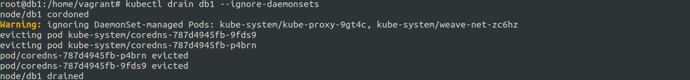
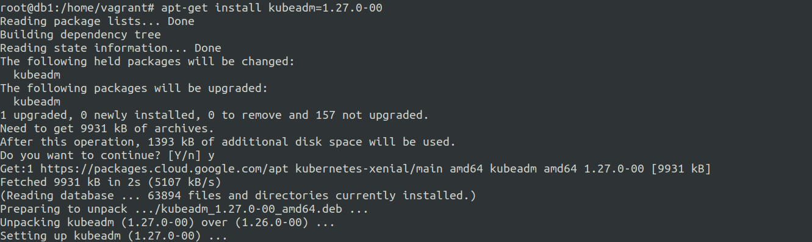
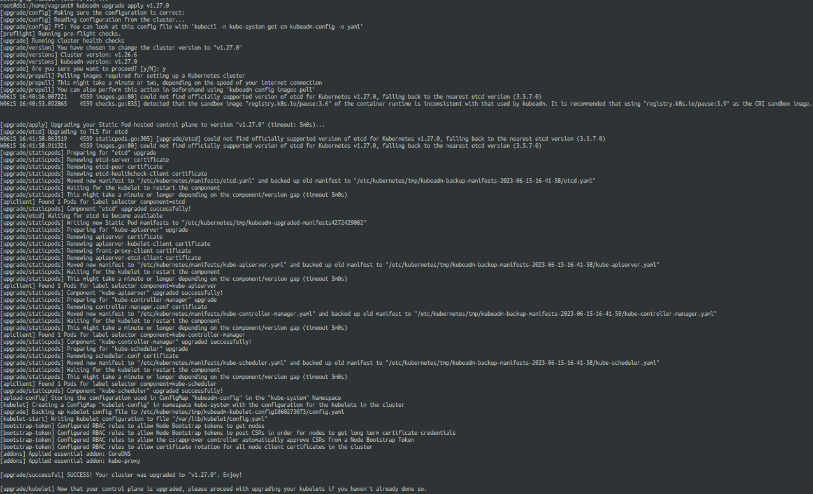
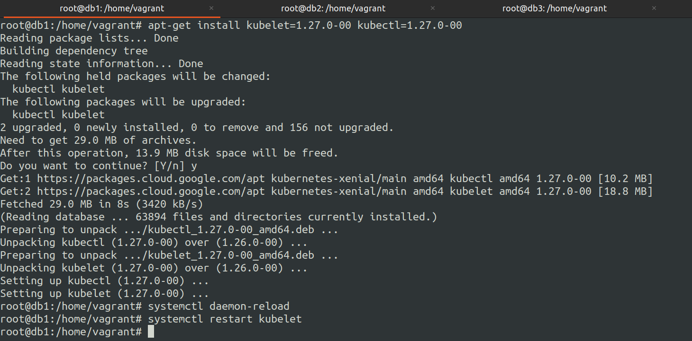
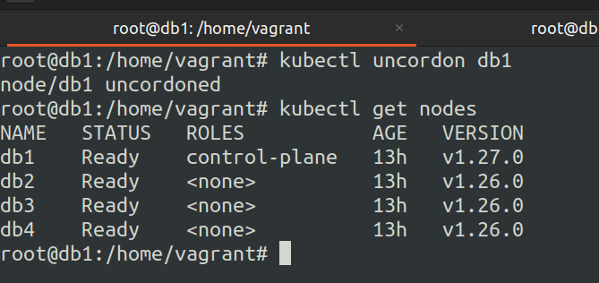
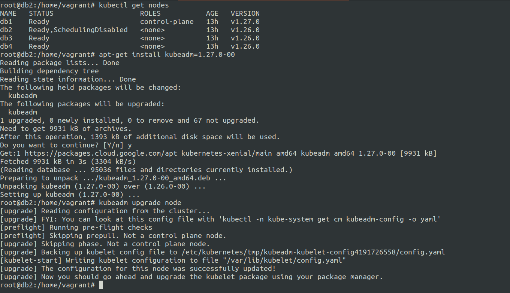
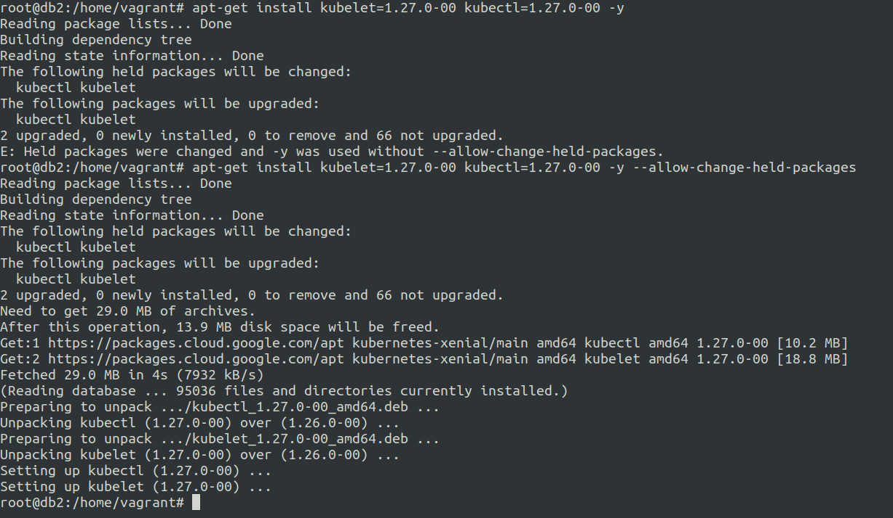
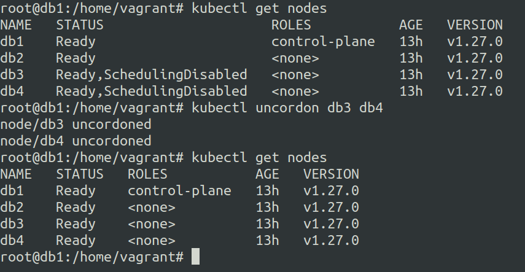

# Upgrade kubernetes cluster
15 June 2023

***So what are we going to do ?***
---

We will upgrade kubernetes cluster from **v1.26.0**  to **v1.27.0**.

essentially the upgrade involves installation of kubeadm, kubectl and kubelet packages.


***Process of the cluster upgrade from v1.26.0 to v1.27.0 :-***
---

***Following are the phases involved during this version upgrade :-***

1. upgrade the control node.
2. upgrade the worker nodes.


We will setup the 4 node k8s cluster locally you can checkout **k8s-1.3-initialize-and-setup-k8s-cluster.md** post on how to set it up.


***steps to upgrade control node:-***

1. drain the control node using 

    ```kubectl drain CONTROL_NODE --skip-daemonsets```
    


2. install kubeadm package with the **v1.27.0** on the control node. 
    
    ```sudo apt-get install kubeadm=1.27.0-00```
    

3. upgrade the node components using on the control node. 
    
    ```kubeadm upgrade apply v1.27.0``` 
    


4. install the kubelet and kubectl **v1.27.0** packages on the control node. 

    ```sudo apt-get install kubelet=1.27.0-00 kubectl=1.27.0-00```
    


5. reload system daemon and restart the kubelet on the control node. 
    ```
    systemctl daemon-reload
    systemctl restart kubelet
    ```
    
6. uncordon the control node. 
    
    ```kubectl uncordon CONTROL_NODE```
    
    

***steps to upgrade worker node:-***

1. drain the worker node
    
    ```kubectl drain WORKER_NODE --skip-daemonsets```

2. install kubeadm package with the **v1.27.0** on the worker node. 
    
    ```sudo apt-get install kubeadm=1.27.0-00```
    

3. upgrade the node components using on the worker node.

    ```kubeadm upgrade node``` 

4. install the kubelet and kubectl **v1.27.0** packages on the worker node.  

    ```sudo apt-get install kubelet=1.27.0-00 kubectl=1.27.0-00```
    
5. reload system daemon and restart the kubelet.
    ``` 
    systemctl daemon-reload
    systemctl restart kubelet
    ```
6. uncordon the worker node.
    
    ```kubectl uncordon WORKER_NODE```
    


