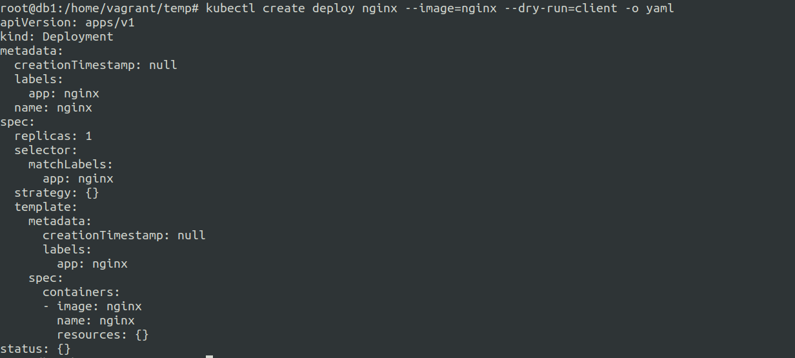
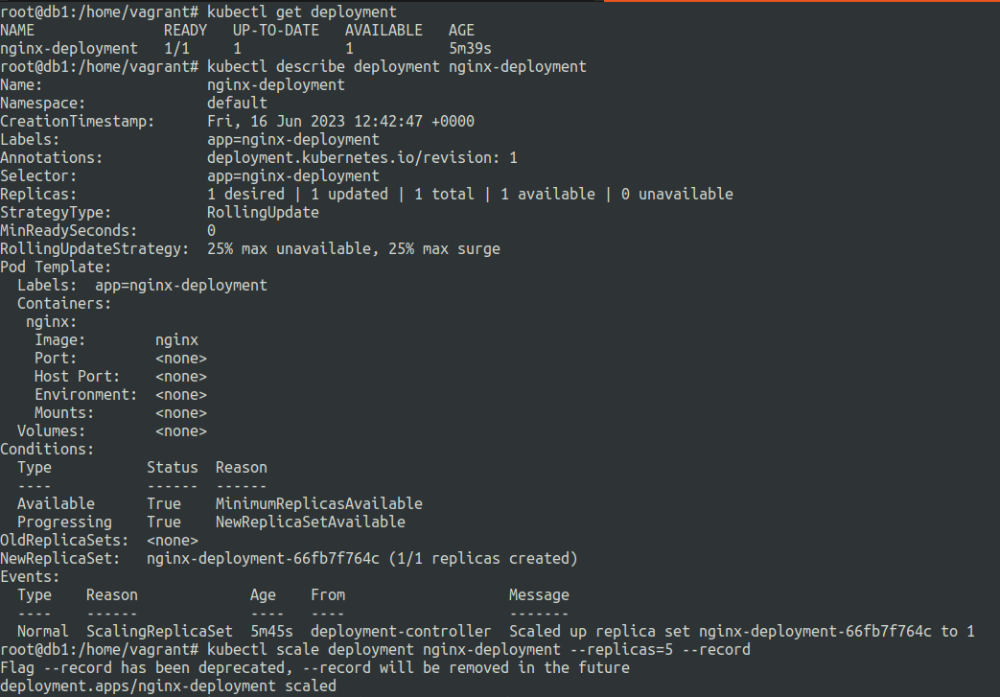
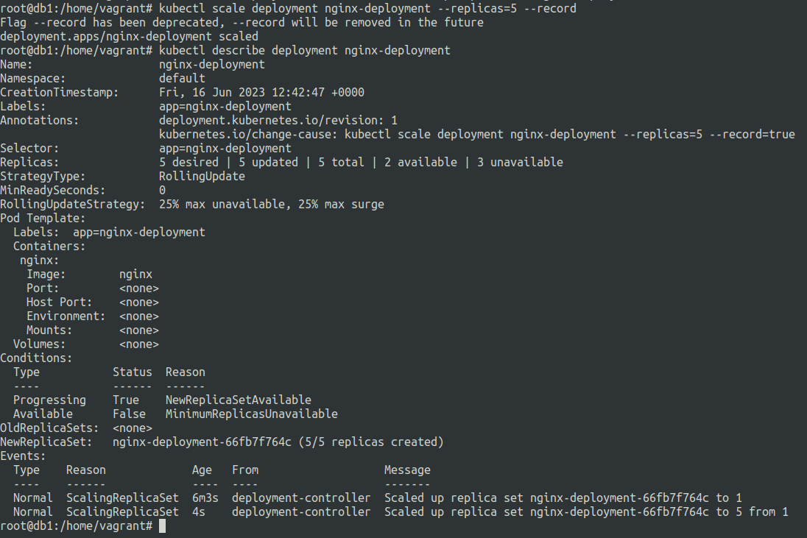
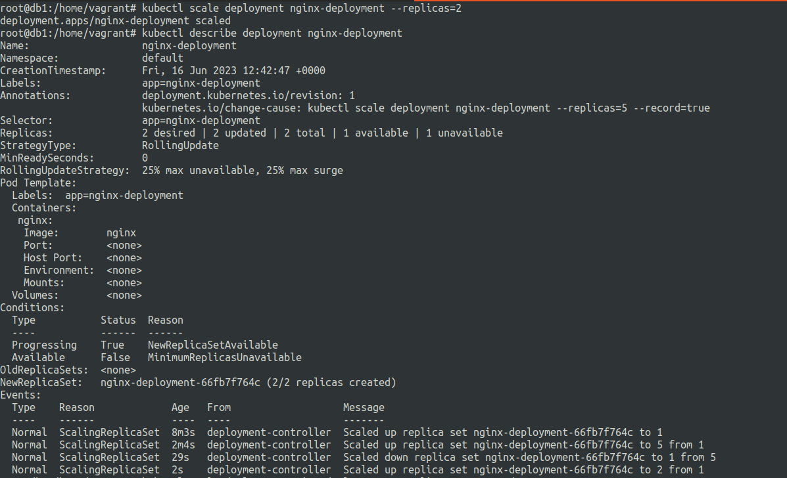

# Some basic k8s commands and tricks.
16 June 2023

***declarative***
---

* manifest file based.
* manifest files: all objects are difined in the manifest file.
* kubectl apply command is usually used.


***imperative***
---

* command based.
* No manifest files: objects are created using cli commands.

---

***Some useful things of kubectl***
---


**Generate a manifest file using imperative commands :**

***Example :-***

```kubectl create deployment nginx-deployment --image=nginx --dry-run -o yaml```

or

```kubectl create deploy nginx --image=nginx --dry-run=client -o yaml```



**Record the commands to the deployment annotations**

```kubectl scale deployment nginx-deployment --replicas=5 --record```

The ```--record``` flag records the command in the annotations. 
(How is this useful ? , This habit helps in tracking what actually caused changes to the deployment.)

***Example :-***

```kubectl describe deployment nginx-deployment```



**using --record**

```kubectl scale deployment nginx-deployment --replicas=5 --record```



**not using --record**

```kubectl scale deployment nginx-deployment --replicas=2```




You can see that when we used no record flag we got the last command executed on the Annotations: to be of the last scale to 5.


